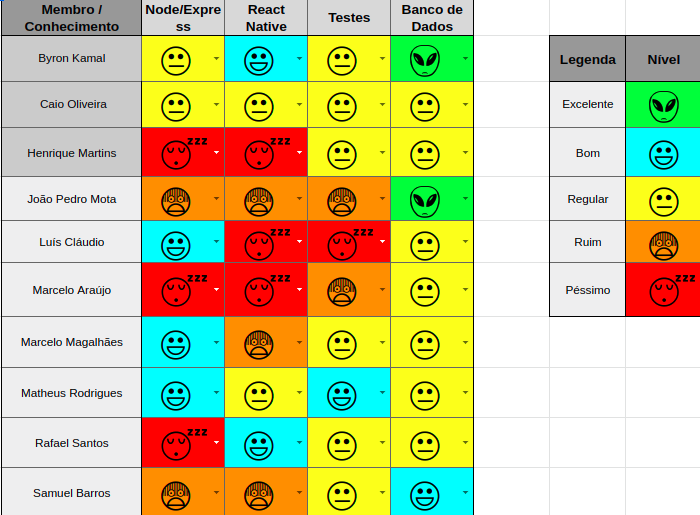

# 1. Resumo

**Data de início:** 16/09/2019

**Data de término** : 23/09/2019

**Número de historias:** 5

| Papel  | Responsável |
| -- | -- |
| Scrum Master | Caio Oliveira |
| Product Owner | Matheus Rodrigues |

# 2. Sprint Backlog

| Tarefas | Pontos |
| --- | --- |
|  Documento de visão  |  5  |
| Estilização do Pages | 5 |
| Documentar/Priorizar Backlog | 3 |
| Protótipo | 5 | 
| Criação dos diagramas | 5 |

**Total de pontos :** 23

# 3. Quadro de conhecimento do iníco da sprint  

# 4. Quadro de pareamento

| Tarefa| Pareamento |
| -- | -- |
|  [Documento de visão](https://github.com/driblo-desenho-de-software-2019-2/docs/issues/12)  |  Byron Kamal, Samuel Barros, Marcelo Magalhães  |
| [Estilização do pages](https://github.com/driblo-desenho-de-software-2019-2/docs/issues/15) | Matheus Rodrigues, Rafael Teodósio, João Pedro Mota      |
| [Documentar/Priorizar backlog](https://github.com/driblo-desenho-de-software-2019-2/docs/issues/13) | Matheus Rodrigues, Henrique Martins, Marcelo Araújo |
| [Protótipo](https://github.com/driblo-desenho-de-software-2019-2/docs/issues/14) | Caio Oliveira, Luís Cláudio | 
| [Criação dos diagrmas](https://github.com/driblo-desenho-de-software-2019-2/docs/issues/16)  | Toda a equipe   |
