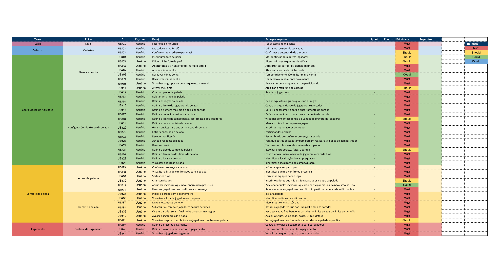

#### Histórico de versão

| Data       | Versão | Descrição                                                     | Autor(es)                                           |
| ---------- | ------ | ------------------------------------------------------------- | --------------------------------------------------- |
| 20/09/2019 | 0.1    | Criação do documento, introdução, product backlog e conclusão | Matheus Rodrigues, Henrique Martins, Marcelo Araujo |
| 20/09/2019 | 0.2    | Adição de metodologia e referência | Marcelo Araujo |

## 1. Introdução

Este documento tem como objetivo apresentar o _Product Backlog_, as histórias de usuário. O backlog é um artefato que representa a acumulação de trabalho, é uma espécie de estoque relativo ao produto que ainda não foi desenvolvido, sendo assim entende-se como uma listagem de pedidos em espera.

## 2. Metodologia

Para a definição do _Product Backlog_, foi tido como base os requisitos levantados e o levantamento do backlog baseado na metodologia definida, junto com o [Backlog do produto](../metodologia#7-diagramas) (tópico 7.8)
As histórias estão separadas em épicos e estes em temas, ou seja, apresentam alguns níveis de granularidade.

## 2. Product Backlog

### Versão 1.0

## 3. Conclusão

Após a elaboração do Product Backlog levantamos 44 histórias que se mostraram importantes para enxergarmos a construção do aplicativo em pequenas partes, possibilitando observar mais requisitos e ter um rastro de onde as coisas acontecem dentro do Driblô.

## 4. Referência

- What is a Product Backlog? Learn About the Scrum Artifact: Product Backlog. Disponível em: https://www.scrum.org/resources/what-is-a-product-backlog
