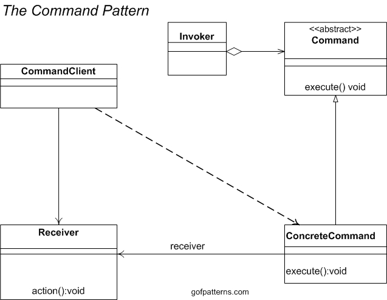

# Command Pattern

### Histórico de versão
| Data | Versão | Descrição | Autor(es) |
| ---- | ------ | --------- | --------- |
| 20/10/2019 | 0.1 | Criação do documento | Samuel Borges |

## Command

### O que é?

O command pattern é um Design Pattern comportamental no qual um objeto é usado para encapsular toda a informação necessária para realizar uma ação ou um evento em um momento posterior. Essas informações incluem o nome do Método, o Objeto a qual o método pertence, e os valores para os parâmetros do método.

### Estrutura mínima

### Problemas solucionados pelo padrão

 1. Como desacoplar o invocador de uma solicitação da solicitação em si? 
 1. Como emitir solicitações para objetos nada sabendo sobre a operação que está sendo solicitada ou sobre o receptor da mesma?

### Benefícios

 1. Separa o objeto que invoca a operação do objeto que "sabe como realizar" a operação.
 1. Facilita a adição de comandos novos, porque mudar as classes exitentes se torna desnecessário.
 1. Facilita o desfazimento (Undo) dos métodos chamados anteriormente. 

### Aplicável no Driblô?

| Problema | Solução é útil ao Driblô? |
| ------- | :-----: |
| Problema 1 |  | 
| Problema 2 |  |
| Problema 3 |  |

(Dizer porque soluções são úteis ou não)

### Referências

[Wikipédia - Command Pattern](https://pt.wikipedia.org/wiki/Command_pattern)

[Wikipédia - Command Pattern - PTBR](https://pt.wikipedia.org/wiki/Command)

[GoFPatterns - Command Pattern](https://www.gofpatterns.com/behavioral-design-patterns/behavioral-patterns/command-pattern.php)

