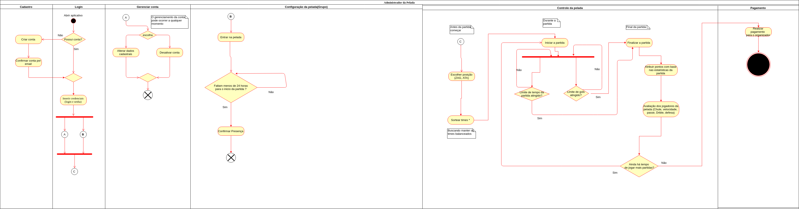

#### Histórico de versão

| Data       | Versão | Descrição            | Autor(es)       |
| ---------- | ------ | -------------------- | --------------- |
| 20/09/2019 | 0.1 | Criação de documento    | Rafael Teodosio e João Mota   |
| 20/09/2019 | 0.2 | Adição do diagrama do usuário comum      | Rafael Teodosio e João Mota   |

## 1.Introdução
O diagrama de atividades ilustra graficamente como será o funcionamento do software (em nível micro ou macro), como será a execução de alguma de suas partes, como será a atuação do sistema na realidade de negócio na qual ele está inserido.

## 2.Diagramas

### 2.1 Administrador

**Versão 1.0**

**Autor: Rafael Teodosio e João Mota**

**Versão 2.0**

**Autor: Rafael Teodosio e João Mota**

### 2.2 Usuário Comum

**Versão 1.0**

**Autor: Rafael Teodosio e João Mota**

## 3.Referências

- Entendendo o Diagrama de Atividades da UML Disponível em: https://www.ateomomento.com.br/uml-diagrama-de-atividades/.