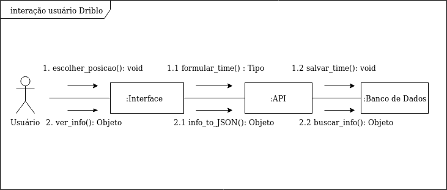
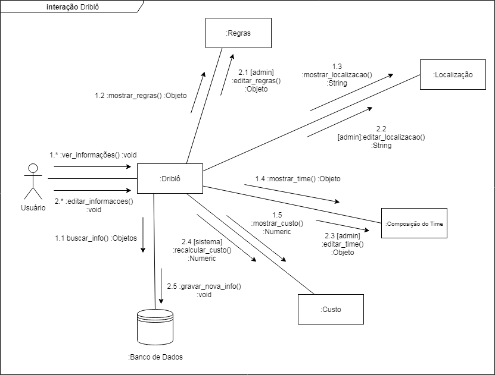

#### Histórico de versão

| Data       | Versão | Descrição            | Autor(es)       |
| ---------- | ------ | -------------------- | --------------- |
| 18/09/2019 | 0.1 | Criação de documento    | Samuel Borges   |
| 18/09/2019 | 0.2 | Adição tópico 1         | Samuel Borges   |
| 19/09/2019 | 0.3 | Adição tópico 2         | Samuel Borges   |
| 19/09/2019 | 0.4 | Adição tópico 3         | Samuel Borges   |

## 1.Introdução
Diagramas de Colaboração são usados para mostrar como objetos diferentes interagem para realizar o comportamento esperado deles em um caso de uso.
Diferente do diagrama de sequencia, o diagrama de colaboração mostra os relacionamentos entre os objetos, expessando, assim, informações similares ao diagrama de sequência de maneira diferente.

## 2.Diagramas

Diagramas de Colaboração representando a interação do usuário com o sistema a fim de visualizar e modificar as informacoes de uma determinada partida.

**Versão 1.0**

**Autor: Samuel Borges**

**Versão 2.0**

**Autor: Samuel Borges**

## 3.Referências

- What is UML Collaboration Diagram? Disponível em: https://www.visual-paradigm.com/guide/uml-unified-modeling-language/what-is-uml-collaboration-diagram/.
- UML Communication Diagrams Overview em: https://www.uml-diagrams.org/communication-diagrams.html 