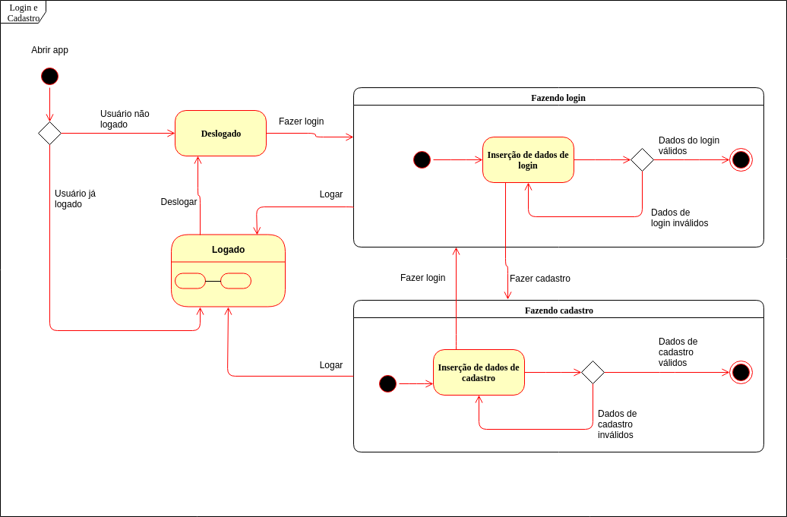
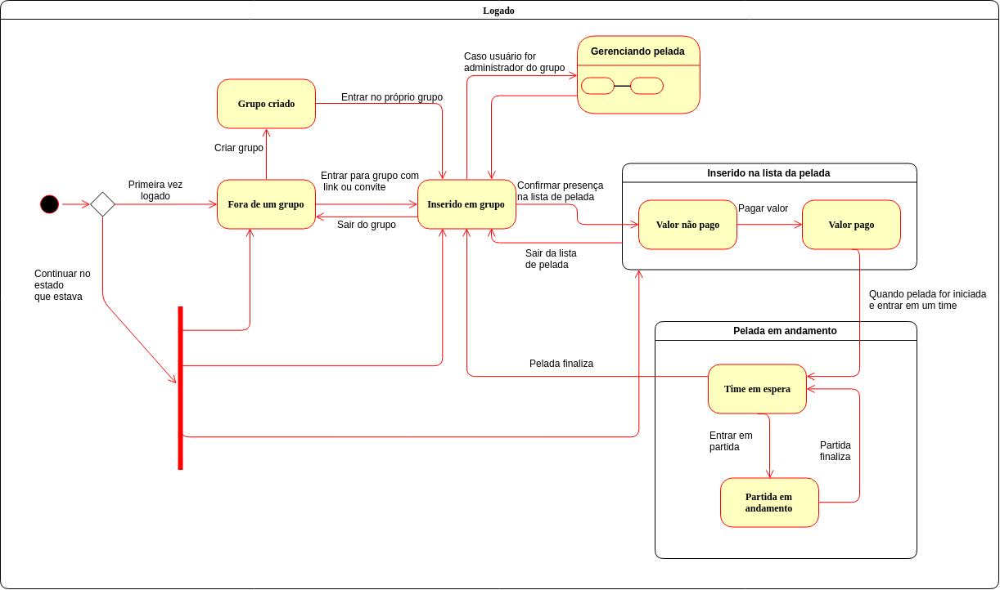
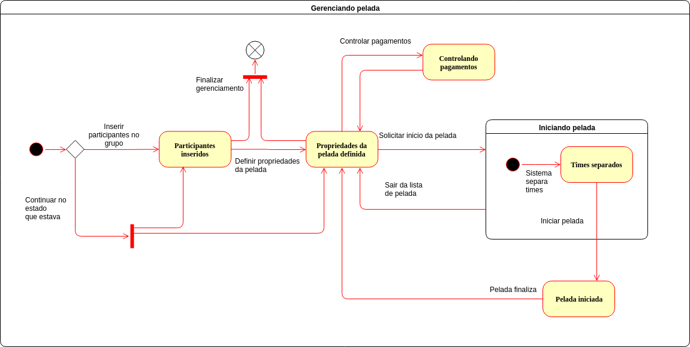

#### Histórico de versão

| Data       | Versão | Descrição            | Autor(es)       |
| ---------- | ------ | -------------------- | --------------- |
| 18/09/2019 | 0.1 | Criação de documento | Marcelo Araújo|
| 18/09/2019 | 0.2 | Adição tópico 1 | Marcelo Araújo|
| 20/09/2019 | 0.3 | Adição dos diagramas de estados | Marcelo Araújo |
| 20/09/2019 | 0.4 | Adição de conclusão e referência | Marcelo Araújo |

## 1.Introdução
O diagrama de estados é uma solução de modelagem UML dinâmica que incide na 
representação dos estados e mudança de estados entre os objetos. Os estados mudam com base nos inputs provendo o output da mudança implementada.

## 2. Diagramas de estados

Esse tipo de diagrama procura apresentar os vários estados pelos quais um objeto pode passar. No app Driblô, há os estados deslogado, logado, fazendo login e fazendo cadastro, alguns deles contendo sub-estados como 'partida em andamento', 'gerenciando pelada' etc. 

### 2.1 Login e Cadastro

#### Versão 1.0

### 2.2 Logado

#### Versão 1.0

### 2.3 Gerenciando da pelada

#### Versão 1.0

## 3. Conclusão

Esse tipo de diagrama auxiliou no entendimento e modelagem da dinâmica da aplicação Driblô, por representarem estados, sub-estados, objetos, interações e entre outros, dentro do sistema e com o meio exterior.

## 4. Referência

- State Machine Diagrams. Disponível em: https://www.uml-diagrams.org/state-machine-diagrams.html
- Wikipedia: UML state machine. Disponível em: https://en.wikipedia.org/wiki/UML_state_machine
