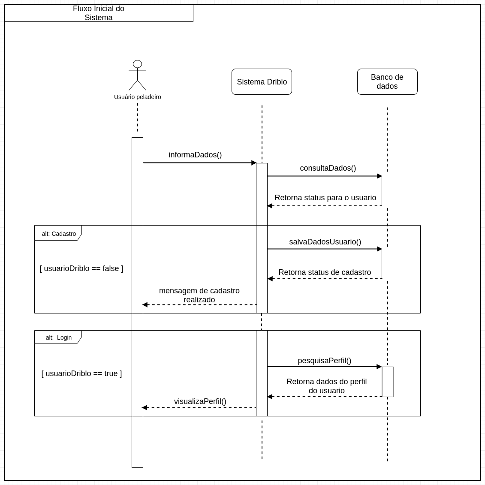
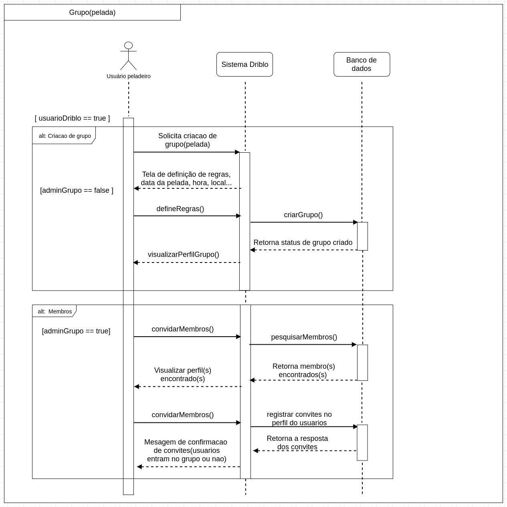

#### Histórico de versão

| Data       | Versão | Descrição            | Autor(es)       |
| ---------- | ------ | -------------------- | --------------- |
| 19/09/2019 | 0.1 | Criação de documento | Luís Cláudio T. Lima|
| 19/09/2019 | 0.2 | Adição tópico 1 | Luís Cláudio T. Lima|
| 19/09/2019 | 0.3 | Adição tópico 2 e de diagrama fluxo inicial | Luís Cláudio T. Lima|
| 19/09/2019 | 0.4 | Adição de diagrama grupos e membros| Luís Cláudio T. Lima|

## 1.Introdução
O diagrama de sequência é uma solução de modelagem UML dinâmica que incide na 
representação das interações entre os objetos em várias linhas de vida. Descreve
como objetos e componentes intetagem uns com os outros para concluir um processo,
função ou operação.

## 2.Diagramas

### 2.1 Fluxo Inicial

#### versão 1.0

---

#### Autor: Luís Cláudio T. Lima

---

### 2.1 Grupos e Membros

#### versão 1.0

---

#### Autor: Luís Cláudio T. Lima

---