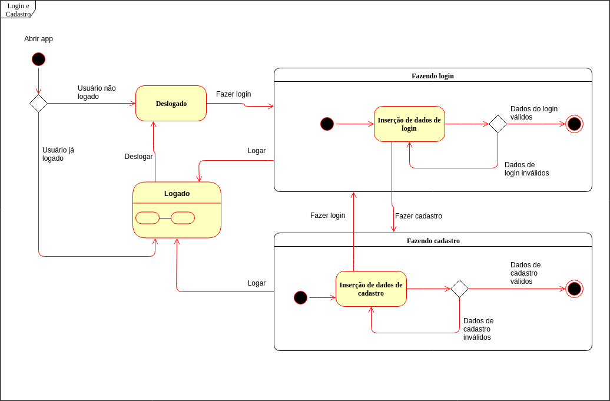
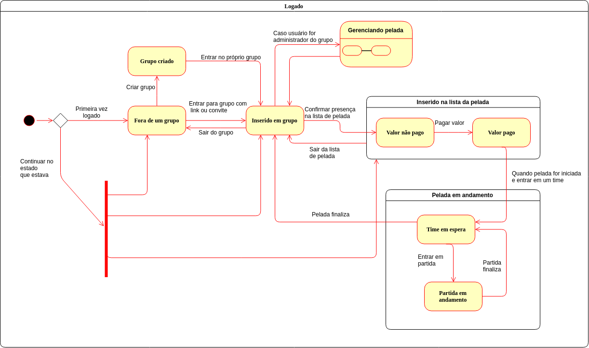
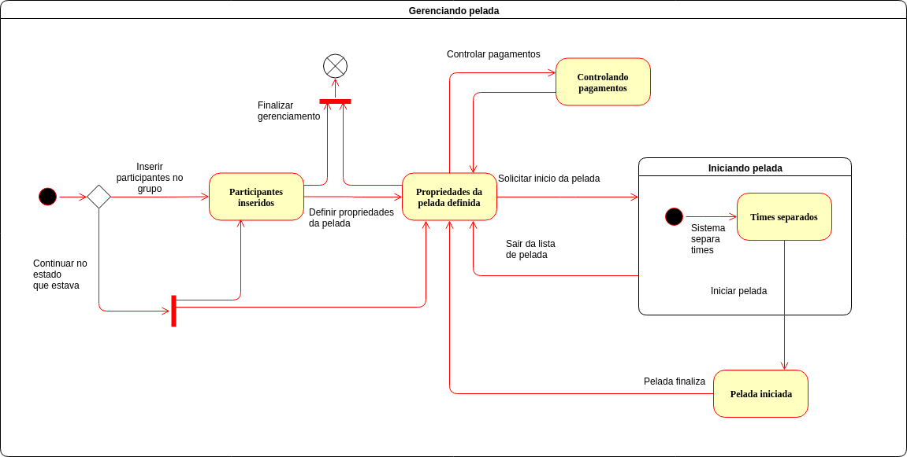

#### Histórico de versão

| Data       | Versão | Descrição            | Autor(es)       |
| ---------- | ------ | -------------------- | --------------- |
| 18/09/2019 | 0.1 | Criação de documento | Luís Cláudio T. Lima|
| 18/09/2019 | 0.2 | Adição tópico 1 | Luís Cláudio T. Lima|
| 20/09/2019 | 0.3 | Adição tópico 2 | Marcelo Araújo |
| 20/09/2019 | 0.4 | Adição dos diagramas de estados | Marcelo Araújo |
| 20/09/2019 | 0.5 | Adição de conclusão e referência | Marcelo Araújo |

2.1 Diagramas de estados

## 1.Introdução
O diagrama de sequência é uma solução de modelagem UML dinâmica que incide na 
representação das interações entre os objetos em várias linhas de vida. Descreve
como objetos e componentes intetagem uns com os outros para concluir um processo
função ou operação.

## 2. Diagramas de estados

O diagrama de estados é uma modelagem UML que representa os estados de uma aplicação. Esse tipo de diagrama procura apresentar os vários estados pelos quais um objeto pode passar.
No app Driblô, há os estados deslogado, logado, fazendo login e fazendo cadastro, alguns deles contendo sub-estados como 'partida em andamento', 'gerenciando pelada' etc. 

### 2.1 Login e Cadastro

#### Versão 1.0

### 2.2 Logado

#### Versão 1.0

### 2.3 Gerenciando da pelada

#### Versão 1.0

## 3. Conclusão

Esses tipos de diagramas auxiliaram no entendimento e modelagem da dinâmica da aplicação Driblô, por representarem estados, sub-fluxos, objetos, interações e entre outros, dentro do sistema e com o meio exterior.

## 4. Referência

- State Machine Diagrams. Disponível em: https://www.uml-diagrams.org/state-machine-diagrams.html
- Wikipedia: UML state machine. Disponível em: https://en.wikipedia.org/wiki/UML_state_machine
