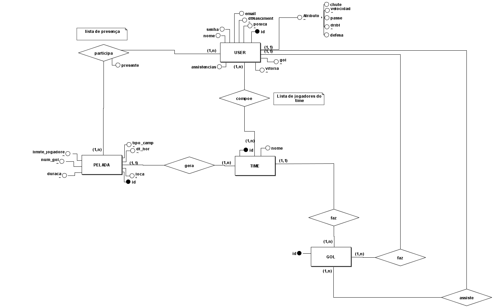
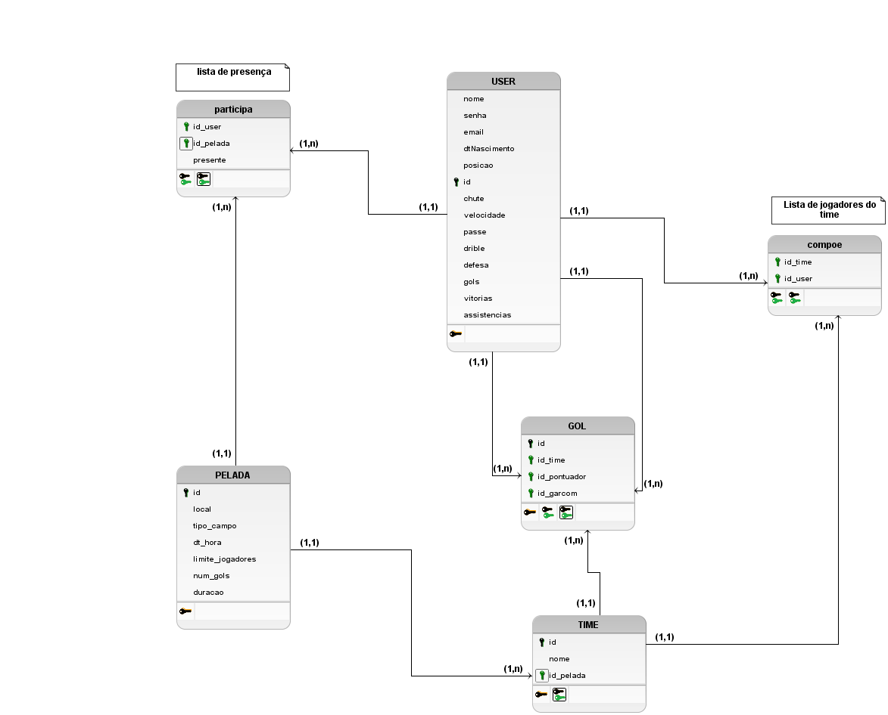
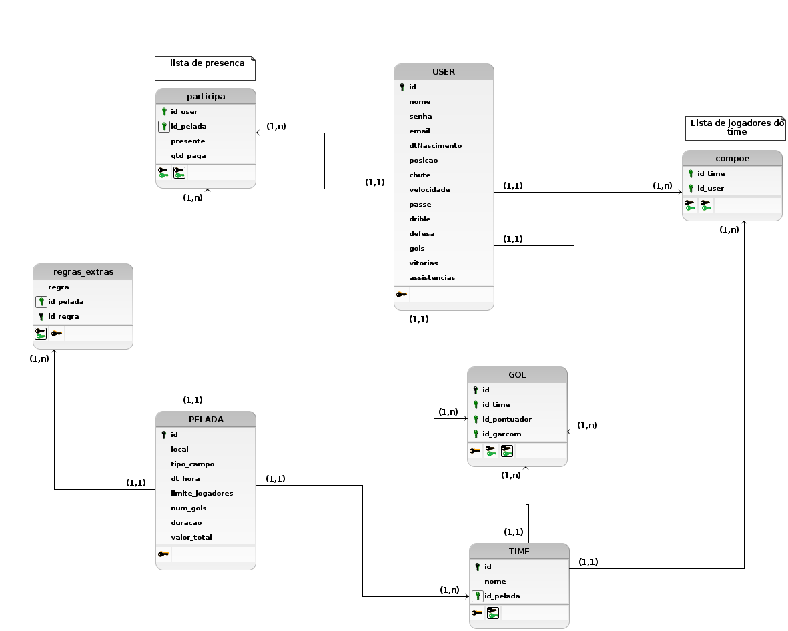

#### Histórico de versão

| Data       | Versão | Descrição            | Autor(es)       |
| ---------- | ------ | -------------------- | --------------- |
| 08/11/2019 | 0.1 | Adição do template do Documento de Arquitetura | Byron Kamal |
| 15/11/2019 | 0.2 | Adição tópico visão geral de introdução e tópico de qualidade | Luís Cláudio T. Lima |
| 15/11/2019 |0.3| Adição MER e DER - Tópico Visão de Dados | Byron Kamal|

## 1. Introdução
[A introdução do Documento de Arquitetura de Software fornece uma visão geral do documento inteiro. Ela inclui a finalidade, o escopo, as definições, os acrônimos, as abreviações, as referências e a visão geral do Documento de Arquitetura de Software.]

### 1.1 Finalidade
Este documento oferece uma visão geral arquitetural abrangente do sistema, usando diversas visões arquiteturais para representar diferentes aspectos do sistema. O objetivo deste documento é capturar e comunicar as decisões arquiteturais significativas que foram tomadas em relação ao sistema.

[Esta seção define o papel ou finalidade do Documento de Arquitetura de Software, na documentação do projeto como um todo, e descreve rapidamente a estrutura do documento. O público-alvo específico do documento é identificado, com uma indicação de como ele espera usar o documento.]

### 1.2 Escopo
 [Uma breve descrição da utilidade do Documento de Arquitetura de Software, do que é afetado por esse documento ou influenciado por ele.]

### 1.3 Definições, Acrônimos e Abreviações
[Esta subseção contém as definições de todos os termos, acrônimos e abreviações necessários para interpretar corretamente o Documento de Arquitetura de Software.  Essas informações podem ser fornecidas fazendo referências ao Glossário do projeto.]

### 1.4 Referências
[Esta subseção fornece uma lista completa dos documentos mencionados em outra parte do Documento de Arquitetura de Software. Identifique cada documento por título, número do relatório (se aplicável), data e organização de publicação. Especifique as fontes a partir das quais as referências podem ser obtidas. Essas informações podem ser fornecidas por um anexo ou outro documento.]
### 1.5 Visão Geral

Este tópico visa detalhar as soluções arquiteturais desenvolvidas no sistema. Desta forma,serão abordados os seguintes aspectos:

* Representação Arquitetural
* Restrições e Metas Arquiteturais
* Visão de Casos de Uso
* Visão Lógica
* Visão de Processos
* Visualização da Implementação
* Visão de Dados
* Tamanho e Desempenho
* Qualidade

## 2. Representação Arquitetural 
[Esta seção descreve qual é a arquitetura de software do sistema atual e como ela é representada. Da Visão de Casos de Uso, Visão Lógica, Visão de Processos, Visão de Implantação e Visão de Implementação, enumera as visões necessárias e, para cada visão, explica quais tipos de elementos de modelo ela contém.]

## 3. Metas e Restrições da Arquitetura 
[Esta seção descreve os requisitos e objetivos do software que têm algum impacto sobre a arquitetura; por exemplo, segurança, garantia, privacidade, uso de um produto desenvolvido internamente e pronto para ser usado, portabilidade, distribuição e reutilização. Ela também captura as restrições especiais que podem ser aplicáveis: estratégia de design e implementação, ferramentas de desenvolvimento, estrutura das equipes, cronograma, código-fonte legado e assim por diante.]

## 4. Visão de Casos de Uso 
[Esta seção lista casos de uso ou cenários do modelo de casos de uso quando eles representam funcionalidade central e significativa do sistema final ou, quando têm uma grande cobertura arquitetural — eles experimentam muitos elementos arquiteturais ou quando enfatizam ou ilustram um ponto complexo e específico da arquitetura.]
4.1 Realizações de Casos de Uso
[Esta seção ilustra o funcionamento do software, apresentando algumas realizações (ou cenários) de casos de uso selecionadas e explica como os diversos elementos do modelo de design contribuem para a respectiva funcionalidade.]

## 5. Visão Lógica 
[Esta seção descreve as partes significativas do ponto de vista da arquitetura do modelo de design, como sua divisão em subsistemas e pacotes. Além disso, para cada pacote significativo, ela mostra sua divisão em classes e utilitários de classe. Apresente as classes significativas do ponto de vista da arquitetura e descreva suas responsabilidades, bem como alguns relacionamentos, operações e atributos de grande importância.]

### 5.1 Visão Geral
[Esta subseção descreve toda a decomposição do modelo de design em termos de camadas e de hierarquia de pacotes.]

### 5.2 Pacotes de Design Significativos do Ponto de Vista da Arquitetura
[Para cada pacote significativo, inclua uma subseção com o respectivo nome, uma breve descrição e um diagrama com todos os pacotes e classes significativos nele contidos. 
Para cada classe significativa no pacote, inclua o respectivo nome, uma breve descrição e, opcionalmente, uma descrição de algumas das suas principais responsabilidades, operações e atributos.]

## 6. Visão de Processos 
[Esta seção descreve a decomposição do sistema em processos leves (threads simples de controle) e processos pesados (agrupamentos de processos leves). Organize a seção em grupos de processos que se comunicam ou interagem. Descreva os modos principais de comunicação entre processos, como transmissão de mensagens e interrupções.]

## 7. Visão de Implantação 
[Esta seção descreve uma ou mais configurações da rede física (hardware) na qual o software é implantado e executado. Ela é uma visão do Modelo de Implantação. No mínimo, para cada configuração, ela deve indicar os nós físicos (computadores, CPUs) que executam o software e suas interconexões (barramento, LAN, ponto a ponto, etc.) É incluído também um mapeamento dos processos da Visão de Processos nos nós físicos.]

## 8. Visão da Implementação 
[Esta seção descreve a estrutura geral do modelo de implementação, a divisão do software em camadas e os subsistemas no modelo de implementação e todos os componentes significativos do ponto de vista da arquitetura.]

## 9. Visão de Dados
### 9.1 Modelo Entidade-Relacionamento (M-ER)
#### Versão 1

### 9.2 Diagrama Entidade-Relacionamento (D-ER)
#### Versao 1

#### Versao 2

## 10. Tamanho e Desempenho 
[Uma descrição das principais características de dimensionamento do software que têm um impacto na arquitetura, bem como as restrições do desempenho desejado.]

## 11. Qualidade 

A arquitetura utilizada contribui para com o software em diversos aspectos. Os padrões arquiteturais das nossas principais frentes do sistema contribuem para a escalabilidade da aplicação, pois contribui altamente para a separação clara de responsabilidades e seus componentes podem ser facilmente substituídos por outros de sua própria implementação. Essa característica da clara separação de conceitos do MVC trás diversos outros benefícios para a aplicação em geral, como testabilidade e manutenabilidade.

Os seguintes itens conferem ao sistema aspectos de qualidade, bem como a descrição da abordagem realizada para satisfazer esses aspectos.

| Item       | Solução | Descrição                                      |
|------------|---------|------------------------------------------------|
| Escalabilidade | Arquitetura de Micros serviços | Em prol de permitir que o sistema evolua sem grandes gargalos, o sistema de modularização aplicado pela arquitetura de micros serviços propicia alterações no funcionamento de um serviço sem alterações em grande escala nos demais serviços relacionados, permitindo modificações mais pontuais e uma integração facilitada do sistema.  |
| Confiabilidade | Manutenção Periódica e Modularização do Sistema | Pela modularização do sistema permitir menor impacto de um micros serviço no funcionamento de outro, a prática de manutenções periódicas permite a solução de problemas de forma pontual e sem impedir o funcionamento de demais serviços, ao contrário de abordagens monolíticas  |
| Segurança | Dados criptografados e Servidor Remoto | Para garantir a segurança de informações sensíveis, a abordagem utilizada será a encriptação de dados e utilização de Hashes, permitindo que informações puras não trafeguem por mais módulos da aplicação do que o necessário, armazenando-as no servidor remoto e acessando-as por meio das hashes.  |
| Portabilidade | Arquitetura de Micros serviços | A Utilização da arquitetura de micros serviços permite o desenvolvimento do Backend da aplicação desacoplado do Frontend, permitindo então que esse Frontend seja adaptado para diferentes plataformas, com um funcionamento equivalente conforme o que foi implementado no Backend, contando ainda com a independência de funcionamento de cada serviço.  |