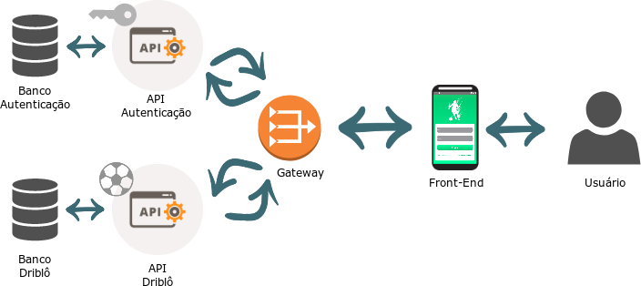
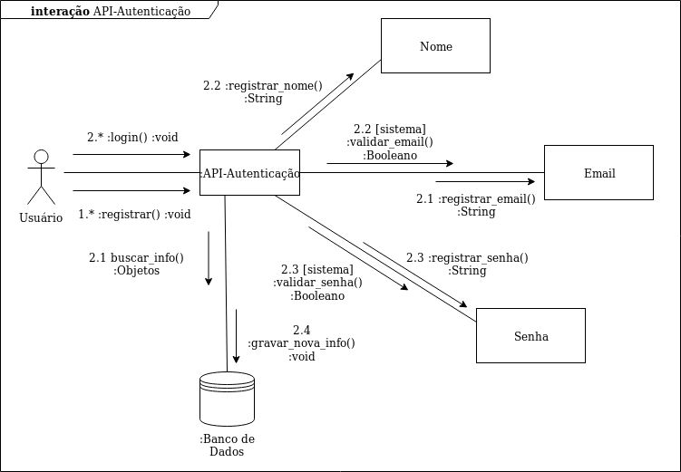
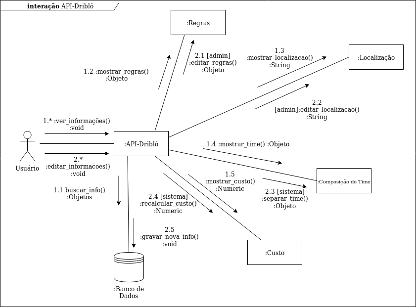
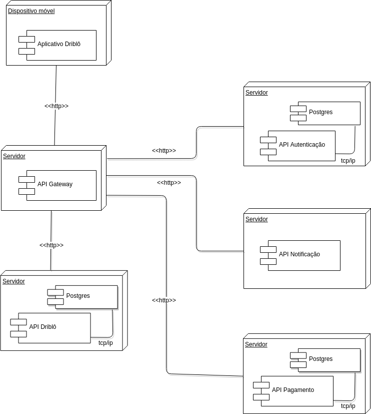

#### Histórico de versão

| Data       | Versão | Descrição            | Autor(es)       |
| ---------- | ------ | -------------------- | --------------- |
| 08/11/2019 | 0.1 | Adição do template do Documento de Arquitetura | Byron Kamal |
| 15/11/2019 | 0.2 | Adição tópico visão geral de introdução e tópico de qualidade | Luís Cláudio T. Lima |
| 15/11/2019 | 0.3 | Adição MER e DER - Tópico Visão de Dados | Byron Kamal|
| 15/11/2019 | 0.4 | Adição tópico Estilos e padrões arquiteturais| Byron Kamal|
| 15/11/2019 | 0.5 | Adição tópico Metas e Restrições da Arquitetura| Rafael Teodosio e Henrique Martins|
| 15/11/2019 | 0.6 | Adição tópico Introdução e Escopo| João Pedro Mota|
| 15/11/2019 | 0.7 | Adição das Definições, Acrônimos e Abreviações | Samuel Borges |
| 15/11/2019 | 0.8 | Adição da Representação Arquitetural | Samuel Borges |
| 15/11/2019 | 0.9 | Adição da finalidade na introdução | Marcelo Araújo |
| 17/11/2019 | 1.0 | Adição de algumas referências | Henrique Martins |
| 17/11/2019 | 1.1 | Corrigindo erro do tópico 1.4 | Henrique Martins |
| 17/11/2019 | 1.2 | Adição da Visão de Casos de Uso | Samuel Borges |
| 18/11/2019 | 1.3 | Remoção do tópico sobre Tamanho e Desempenho | Henrique Martins |
| 18/11/2019 | 1.4 | Adição da Visão da Implementação | Marcelo Araújo |

## 1. Introdução
Este documento visa apresentar a arquitetura de software a ser aplicada no sistema  Driblô, de forma que facilite a visualização dos requisitos e da estrutura para os envolvidos.

### 1.1 Finalidade
Este documento oferece uma visão geral arquitetural abrangente do sistema, usando diversas visões arquiteturais para representar diferentes aspectos do sistema. O objetivo deste documento é capturar e comunicar as decisões arquiteturais significativas que foram tomadas em relação ao sistema.

### 1.2 Escopo
O aplicativo Driblo visa facilitar a vida dos “peladeiros” que gostam de se organizar com amigos para marcarem uma pelada. Esta organização costuma tomar bastante tempo, e, como alguns costumam alugar campos para jogar, dinheiro. As principais funcionalidades do aplicativo são: a organização da pelada e a separação equilibrada dos times.

### 1.3 Definições, Acrônimos e Abreviações

* **Driblô** - Nome do sistema a ser desenvolvido
* **Pelada** - Evento onde pessoas se juntam para jogar partidas de futebol
* **Usuário, Jogador, Peladeiros, Participante** - Usuário da aplicação participante do evento
* **Administrador** - Usuário que administra a pelada
* **Front-end** - Parte do software responsável pela interface de interação com o usuário
* **Back-end** - Parte do software responsável pelas regras de negócio da aplicação
* **API** - Interface ou protocolo de comunicação entre um cliente e um servidor feito com a intenção de simplificar a construção de Front-ends
* **Microsserviço** - Técnica arquitetural que organiza a aplicação como uma coleção de serviços fracamente acoplados.
* **MVC** - Padrão de arquitetura de software focado no reuso de código e a separação de conceitos em três camadas interconectadas.

### 1.4 Referências

[Tutorial](http://www.linhadecodigo.com.br/artigo/3343/como-documentar-a-arquitetura-de-software.aspx) - Como Documentar a Arquitetura de Software

[Translate-me](https://translate-me.github.io/docs/documentos/projeto/doc_de_arquitetura/) - Documento de Arquitetura

### 1.5 Visão Geral

Este tópico visa detalhar as soluções arquiteturais desenvolvidas no sistema. Desta forma,serão abordados os seguintes aspectos:

* Representação Arquitetural
* Restrições e Metas Arquiteturais
* Visão de Casos de Uso
* Visão Lógica
* Visão de Processos
* Visualização da Implementação
* Visão de Dados
* Tamanho e Desempenho
* Qualidade

## 2. Representação Arquitetural

### Diagrama de Relações

A imagem acima mostra a relação entre os microsserviços usados na arquitetura do projeto.
Abaixo serão explicados os microsservicos e suas funções.

#### API Driblô

Serviço responsável pela parte negocial da aplicação. Ou seja, responsável por: atribuir usuários a peladas e times, marcar gols e assistências de usuários, dividir os times por habilidade, e retornar a represetação dos objetos necessários. Possui um banco de dados próprio.

#### API Autenticação

Serviço responsável pelo registro e autenticação de usuários na aplicação. Possui um banco de dados próprio.

#### Front End

Interface para comunicação com o usuário.

#### Gateway

Serviço responsável pela comunicação entre os diversos serviços da aplicação.

### Model View Controller (MVC)

As APIs utilizam o padrão de projeto MVC para separar a lógica do programa em três elementos.

* **Model:** Camada responsável pela leitura, manipulação e validação dos dados;
* **Controller:** Camada responsável pela manipulação e validação das requisições do usuário, traduzindo em comandos enviados para enviados para a Model e/ou View;
* **View:** Camada de interface com o usuário, responsável pela representação dos dados.

No projeto não será utilizada a camada View, visto que a interface será feita em um serviço separado responsável unicamente por isso.

## 3. Metas e Restrições da Arquitetura 
- É necessária a conexão com internet para utilização do App.
- A informação pessoal do usuário será armazenada no banco de dados.
- A aplicação terá suporte somente para Android.
- A IDE utilizada para o desenvolvimento do App é o Android Studio versão 3.4.1 ou o Gennymotion.
- O Front-End e o Back-End será feito em JavaScript.
- Serão usadas as plataformas React-Native para o Front-end e NodeJS para o Back-end.
- Os dados extraídos do Front-End serão armazenados no banco de dados PostgreSQL.
- Será feita uma arquitetura de microsserviços, para um melhor funcionamento e desempenho do sistema, não possuindo dependências entre si.
- O sistema não terá uma grande quantidade de dados, mesmo assim deverá ser feita a persistência desses dados utilizando o banco relacional PostgreSQL.
- A aplicação deve ser terminada até o final da disciplina de Desenho e Arquitetura de Software.

## 4. Visão de Casos de Uso 
### 4.1 Especificações dos casos de uso
| Casos de Uso       | API Relacionada | Descrição|
| :------------- | :----------: | :------------- |
|  UC01 - Registro | API de Autenticação | O usuário registra suas informações na aplicação, é necessário para ter acesso às funcionalidades da aplicação| 
|  UC02 - Login  | API de Autenticação |O usuário valida suas informações e consegue acesso às outras funcionalidades|
|  UC03 - Criar Pelada | API Driblô | O usuário cria e agenda uma pelada |
|  UC04 - Alterar informações da Pelada | API Driblô | O usuário muda as informações da pelada|
|  UC05 - Adicionar membros à Pelada | API Driblô | O usuário adiciona outros usuários ao grupo da pelada|
|  UC06 - Visualizar membros da Pelada | API Driblô | O usuário visualiza a lista de membros que fazem parte do grupo da Pelada em questão|
|  UC07 - Atualizar regras da Pelada | API Driblô | O usuário altera as regras vigentes da Pelada em questão|
|  UC08 - Marcar Gols | API Driblô | O usuário marca os gols feitos durante a partida, guardando as informacao de quem fez o gol e de quem ajudou a fazê-lo|
|  UC09 - Visualizar Gols da Pelada | API Driblô | O usuário visualiza a lista de gols marcados durante a partida|

### 4.1 Realizações de Casos de Uso

#### 4.1.1 Diagrama de Colaboração da API de Autenticação

O diagrama acima ilustra as os casos de uso relacionados à API de autenticação, que é responsável pelo registro e validação de usuários e possui banco de dados próprio.

#### 4.1.2 Diagrama de Colaboração da API do Driblô

O diagrama acima ilustra as os casos de uso relacionados à API do driblô, que é responsável por toda a parte negocial da aplicação e também possui banco de dados próprio.

## 5. Visão Lógica 
[Esta seção descreve as partes significativas do ponto de vista da arquitetura do modelo de design, como sua divisão em subsistemas e pacotes. Além disso, para cada pacote significativo, ela mostra sua divisão em classes e utilitários de classe. Apresente as classes significativas do ponto de vista da arquitetura e descreva suas responsabilidades, bem como alguns relacionamentos, operações e atributos de grande importância.]

### 5.1 Visão Geral
[Esta subseção descreve toda a decomposição do modelo de design em termos de camadas e de hierarquia de pacotes.]

### 5.2 Pacotes de Design Significativos do Ponto de Vista da Arquitetura
[Para cada pacote significativo, inclua uma subseção com o respectivo nome, uma breve descrição e um diagrama com todos os pacotes e classes significativos nele contidos. 
Para cada classe significativa no pacote, inclua o respectivo nome, uma breve descrição e, opcionalmente, uma descrição de algumas das suas principais responsabilidades, operações e atributos.]

## 6. Visão de Processos 
[Esta seção descreve a decomposição do sistema em processos leves (threads simples de controle) e processos pesados (agrupamentos de processos leves). Organize a seção em grupos de processos que se comunicam ou interagem. Descreva os modos principais de comunicação entre processos, como transmissão de mensagens e interrupções.]

## 7. Visão de Implantação 
[Esta seção descreve uma ou mais configurações da rede física (hardware) na qual o software é implantado e executado. Ela é uma visão do Modelo de Implantação. No mínimo, para cada configuração, ela deve indicar os nós físicos (computadores, CPUs) que executam o software e suas interconexões (barramento, LAN, ponto a ponto, etc.) É incluído também um mapeamento dos processos da Visão de Processos nos nós físicos.]

## 8. Visão da Implementação 
### 8.1 Diagrama de Implantação

Diagrama de implementação serve para descrever a estrutura geral do modelo de implementação, dar uma visão de como seria implementado em hardware a arquitetura proposta. Mostra o software em camadas e os subsistemas
no modelo de implementação e todos os componentes significativos do ponto de vista da arquitetura.

#### Versão 1

## 9. Visão de Dados
### 9.1 Modelo Entidade-Relacionamento (M-ER)
#### Versão 1

### 9.2 Diagrama Entidade-Relacionamento (D-ER)
#### Versao 1

#### Versao 2

## 10. Estilos/padrões arquiteturais
### 10.1 Arquitetura Monolítica vs Distribuída
No projeto optou-se por uma arquitetura baseada em microserviços, que segue uma estrutura distribuída. Nesse modelo tem como base a organização do software em diversos sistemas independentes que se comunicam, no caso desse projeto via protocolo HTTP, e formam um sistema maior. Além de permitir uma alta coesão e um baixo acoplamento, uma arquitetura distribuída facilita questões de infraestrutura, como facilidade de gerenciamento de múltiplos servidores e tolerância a falhas.

### 10.2 MVC
O Node JS, utilizado no backend do projeto, se baseia em um modelo  MVC (Model-View-Controller). O projeto apresenta as tradicionais camadas Model e Controller, porém o papel da View, que tem o papel de decidir como e qual dado será exibido, é substituído pelo front-end, desenvolvido em React Native. A parte de abstração e comunicação com o Banco de Dados é feito através do ORM (Object-relational mapping) Sequelize.

### Cliente-servidor
Mesmo utilizando uma arquitetura baseada em microserviços, o projeto é dividido back-end e o front-end. Por mais que a aplicação seja um aplicativo mobile, a interface ainda se trata de um cliente e todo o sistema por trás que recebe as requisições de um servidor, funcionando como um modelo cliente-servidor clássico. Além disso, alguns serviços específicos no back-end, como o de autenticação, tem o papel apenas de registrar os usuários em um banco independente e renovar/criar tokens de acesso para os mesmos, servido basicamente como um servidor 

## 11. Qualidade 

A arquitetura utilizada contribui para com o software em diversos aspectos. Os padrões arquiteturais das nossas principais frentes do sistema contribuem para a escalabilidade da aplicação, pois contribui altamente para a separação clara de responsabilidades e seus componentes podem ser facilmente substituídos por outros de sua própria implementação. Essa característica da clara separação de conceitos do MVC trás diversos outros benefícios para a aplicação em geral, como testabilidade e manutenabilidade.

Os seguintes itens conferem ao sistema aspectos de qualidade, bem como a descrição da abordagem realizada para satisfazer esses aspectos.

| Item       | Solução | Descrição                                      |
|------------|---------|------------------------------------------------|
| Escalabilidade | Arquitetura de Micros serviços | Em prol de permitir que o sistema evolua sem grandes gargalos, o sistema de modularização aplicado pela arquitetura de micros serviços propicia alterações no funcionamento de um serviço sem alterações em grande escala nos demais serviços relacionados, permitindo modificações mais pontuais e uma integração facilitada do sistema.  |
| Confiabilidade | Manutenção Periódica e Modularização do Sistema | Pela modularização do sistema permitir menor impacto de um micros serviço no funcionamento de outro, a prática de manutenções periódicas permite a solução de problemas de forma pontual e sem impedir o funcionamento de demais serviços, ao contrário de abordagens monolíticas  |
| Segurança | Dados criptografados e Servidor Remoto | Para garantir a segurança de informações sensíveis, a abordagem utilizada será a encriptação de dados e utilização de Hashes, permitindo que informações puras não trafeguem por mais módulos da aplicação do que o necessário, armazenando-as no servidor remoto e acessando-as por meio das hashes.  |
| Portabilidade | Arquitetura de Micros serviços | A Utilização da arquitetura de micros serviços permite o desenvolvimento do Backend da aplicação desacoplado do Frontend, permitindo então que esse Frontend seja adaptado para diferentes plataformas, com um funcionamento equivalente conforme o que foi implementado no Backend, contando ainda com a independência de funcionamento de cada serviço.  |
