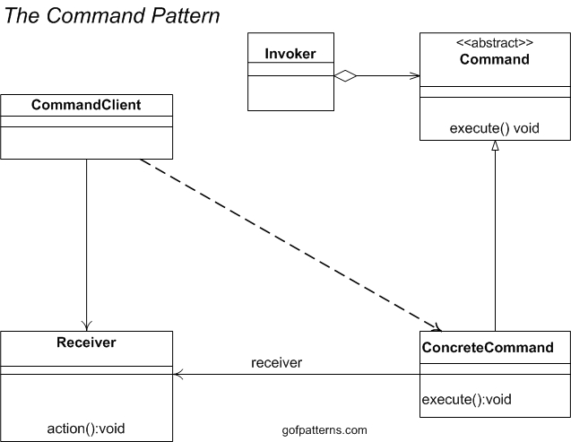
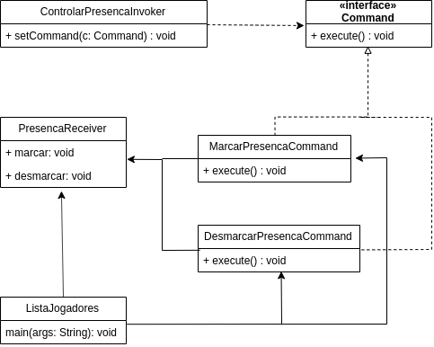
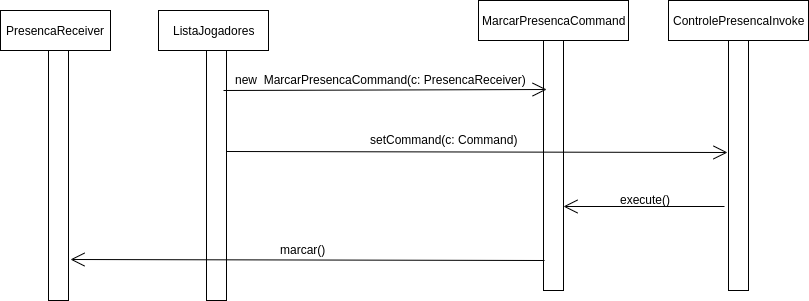

# GOFs: Command e Mediator

### Histórico de versão
| Data | Versão | Descrição | Autor(es) |
| ---- | ------ | --------- | --------- |
| 20/10/2019 | 0.1 | Criação do documento | Samuel Borges |
| 20/10/2019 | 0.2 | Complementação dos topicos 1 e 4 | Marcelo Magalhães |
| 20/10/2019 | 0.3 | Pertinência em relação ao Driblô | Samuel Borges |
|20/10/2019| 0.4 | Tópico 1 - Mediator | Byron Kamal, João Pedro Mota, Caio Oliveira, Rafael Teodosio|
|20/10/2019| 0.5 | Tópico 2 - Mediator | Byron Kamal, João Pedro Mota, Caio Oliveira, Rafael Teodosio|
|20/10/2019| 0.6 | Exemplo de uso command, Diagrama de classe e diagrama de sequencia | Matheus Rodrigues|

## 1.Command

### 1.1 O que é?

O command pattern é um Design Pattern comportamental no qual um objeto é usado para encapsular toda a informação necessária para realizar uma ação ou um evento em um momento posterior. Essas informações incluem o nome do Método, o Objeto a qual o método pertence, e os valores para os parâmetros do método.

Dessa forma o padrão Command encapsula uma solicitação vinculando um conjunto de ações em um receptor especifico. Para fazer isto ele precisa empacotar as ações e o receptor em um objeto que expõe um único método normalmente chamado execute(). Quando execute() é chamado ele invoca as ações no receptor. Externamente nenhum outro objeto sabe o que realmente será invocado ou mesmo em qual receptor.

### 1.2 Estrutura mínima

### 1.3 Problemas solucionados pelo padrão

 1. Como desacoplar o invocador de uma solicitação da solicitação em si? 
 1. Como emitir solicitações para objetos nada sabendo sobre a operação que está sendo solicitada ou sobre o receptor da mesma?

### 1.4 Benefícios

 1. Separa o objeto que invoca a operação do objeto que "sabe como realizar" a operação.
 1. Evita necessidade conhecer os detalhes específicos de uma classe Receptora, tornando o código mais simples e desacoplado evitando amontoados no código.
 1. Facilita a adição de comandos novos, porque mudar as classes exitentes se torna desnecessário.
 1. Facilita o desfazimento (Undo) dos métodos chamados anteriormente. 
 1. Facilita a implementação de registros de ações executadas (logging) e sistemas transacionais.

### 1.5 Exemplo de aplicação no conceito do Driblô

O cenário a ser aplicado o padrão Command é relacionado a opção do jogador de marcar ou desmacar presença na pelada. [Link do código](https://github.com/driblo-desenho-de-software-2019-2/docs/tree/feature/padroes-gof/padroes-avulso/ExemploCommand)

#### Diagrama de classe - versão 1.0

#### Autor: Matheus Rodrigues

* **Command**: Declara uma interface.
* **ConcreteCommand**: Define uma vinculação entre um objeto, um Receptor e uma ação. 
E também implementa o “execute”.
* **ListaJogadores**: Cria um objeto ConcreteCommand e estabelece o seu Receptor.
* **ControlePresencaInvoker**: Solicita ao Command a execução da solicitação
* **PresencaReceiver**: Sabe como executar as operações associadas a uma solicitação. 
Qualquer classe pode funcionar como um Receiver.

#### Diagrama de sequencia - versão 1.0

#### Autor: Matheus Rodrigues

Primeiro o ListaJogadores cria um novo Command especificando seu Receptor, em seguida este Command é armazenado em um Invoker. O Invoker quando quer chamar a ação do Receptor, usa o método execute do Command que por sua vez chama a ação do Receptor. Deste modo o Invoker não conhece como funciona a ação e também não conhece o Receptor.

### 1.5 Aplicável no Driblô?

| Problema | Solução é útil ao Driblô? |
| ------- | :-----: |
| Usuário pode mudar de ideia em relação às informações passadas anteriormente.| Sim, pois facilitar a implementação de um sistema de desfazimento de ações seria bastante pertinente ao projeto. | 
| Projeto visa entregar o minimo produto viável e crescer conforme necessário. | Sim, pois facilitar a adição de comandos novos ajudaria no desenvolvimento. |

## 2. Mediator

### 2.1 Problema
Em orientação a objetos utiliza-se classes para abstrair um conjunto de objetos com características semelhantes.
Embora as lógicas são geralmente divididas entre as classes, normalmente ligações entre elas são necessárias e consequentemente uma classe começa a conhecer as regras da outra. Além do problema de realizar modificações, o pior caso é onde o um objeto possui conhecimento de todos os outros.
Esse acoplamento torna um objeto refém de outros, fazendo com que ele não consiga funcionar sozinho e assim surge um domínio monolítico.
O resultado é uma modelagem com comportamentos distribuídos entre as classes, mas dependente de outros objetos, encaminhando o desenvolvedor a criar formas mais complexas para realizar customização.

### 2.2 Solução

O Mediator atua como um mediador entre relacionamentos N para N, assim evita a referência explicita aos objetos. Outra vantagem do padrão, é que ele define a maneira que a interação entre os objetos ocorre.

O padrão Mediator consiste de duas figuras principais: o Mediator e o Colleague. O Mediator recebe mensagens de um Colleague, define qual protocolo utilizar e então envia a mensagem. O Colleague define como receberá uma mensagem e envia uma mensagem para um Mediator, portanto é recomendado usar nas seguintes situações : 

- Objetos se comunicam de forma especifica e complexa
- Reutilização de um objeto se torna difícil, devido a quantidade de objetos no qual ele se comunica
- Quando temos comportamentos distribuídos e esse comportamento deveria ser customizável.

### 2.3 Estrutura Minima

### 2.4 Exemplo em Java

### Referências

[Wikipédia - Command Pattern](https://pt.wikipedia.org/wiki/Command_pattern)

[Wikipédia - Command Pattern - PTBR](https://pt.wikipedia.org/wiki/Command)

[GoFPatterns - Command Pattern](https://www.gofpatterns.com/behavioral-design-patterns/behavioral-patterns/command-pattern.php)

[DevMedia - Padrões de Projetos: Introdução aos Padrões Front Controller e Command](https://www.devmedia.com.br/padroes-de-projetos-introducao-aos-padroes-front-controller-e-command/30644)

[Source Making - Command Design Pattern](https://sourcemaking.com/design_patterns/command)

