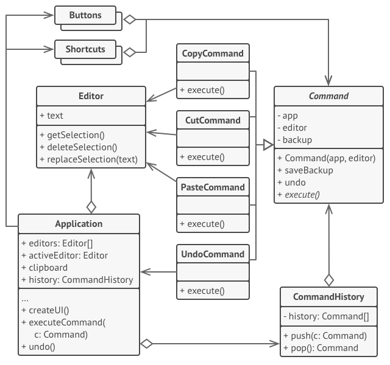
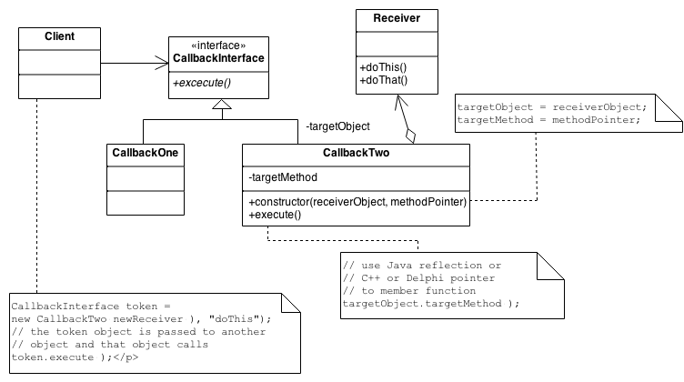
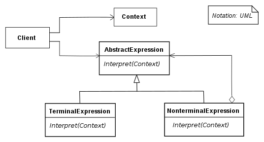
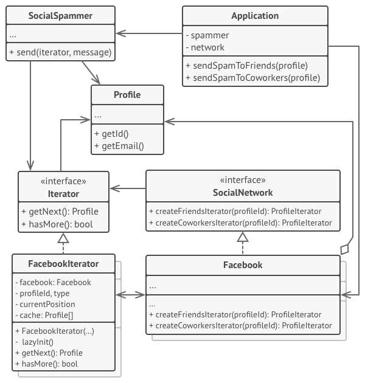

# GOF's Comportamentais

### Histórico de versão
| Data | Versão | Descrição | Autor(es) |
| ---- | ------ | --------- | --------- |
| 18/10/2019 | 0.1 | Criação do documento | Henrique Martins |
| 20/10/2019 | 0.2 | Adicionando conteúdo para alguns padrões | Henrique Martins |

## Introdução

(Acrescentar)

---

## Chain of Responsibility

### O que é?

Chain of Responsibility é um padrão cuja principal função é evitar a dependência entre um objeto receptor e um objeto solicitante. Consiste em uma série de objetos receptores e de objetos de solicitação, onde cada objetos de solicitação possui uma lógica interna que separa quais são tipos de objetos receptores que podem ser manipulados. O restante é passado para o próximo objetos de solicitação da cadeia.

### Estrutura mínima

### Problemas solucionados pelo padrão

 1. A
 1. B

### Benefícios

 1. Reduz o grau de acoplamento. A dissociação solicitará o remetente e o destinatário.
 1. Objeto simplificado. O objeto não precisa conhecer a estrutura da cadeia.
 1. Aprimora a flexibilidade das tarefas atribuídas a objetos. Alterando os membros da cadeia ou alterando sua ordem, permita adicionar ou excluir responsabilidades dinamicamente.
 1. Aumenta a solicitação de processamento de nova classe de muito conveniente.

### Aplicável no Driblô?

| Problema | Solução é útil ao Driblô? |
| ------- | :-----: |
| Problema 1 |  |
| Problema 2 |  |

(Dizer porque soluções são úteis ou não)

---

## Command

### O que é?

Command é um padrão no qual um objeto é usado para encapsular toda informação necessária para executar uma ação ou acionar um evento em um momento posterior.

### Estrutura mínima

### Problemas solucionados pelo padrão

 1. A
 1. B

### Benefícios

 1. Torna o código extensível, pois é possível adicionar novos comandos sem alterar o código existente.
 1. Reduz o acoplamento do invocador e receptor de um comando.

### Aplicável no Driblô?

| Problema | Solução é útil ao Driblô? |
| ------- | :-----: |
| Problema 1 |  |
| Problema 2 |  |

(Dizer porque soluções são úteis ou não)

---

## Interpreter

### O que é?

Interpreter é um dos padrões de projeto de software, famosos como "Design Patterns", muito utilizado para a resolução de problemas quando a modelagem de sistemas ou softwares. Esse padrão esta incluso na categoria de Padrão Comportamental, ou seja, ele busca solucionar problemas de modelagem que tratam o comportamento de classes.

(Imagem de exemplo)

### Estrutura mínima

### Problemas solucionados pelo padrão

 1. A
 1. B

### Benefícios

 1. É fácil alterar e estender a gramática. Como o padrão usa classes para representar regras gramaticais, você pode usar a herança para alterar ou estender a gramática. As expressões existentes podem ser modificadas incrementalmente, e novas expressões podem ser definidas como variações das antigas.
 1. A implementação da gramática também é fácil. As classes que definem nós na árvore de sintaxe abstrata têm implementações semelhantes. Essas classes são fáceis de escrever e geralmente sua geração pode ser automatizada com um compilador ou gerador de analisador.

### Aplicável no Driblô?

| Problema | Solução é útil ao Driblô? |
| ------- | :-----: |
| Problema 1 |  |
| Problema 2 |  |

(Dizer porque soluções são úteis ou não)

---

## Iterator

### O que é?

No Iterator um iterador é usado para percorrer um container e acessar seus elementos. O padrão Iterator desacopla os algoritmos dos recipientes, porém em alguns casos, os algoritmos são necessariamente específicos dos containers e, portanto, não podem ser desacoplados.

### Estrutura mínima

### Problemas solucionados pelo padrão

 1. A
 1. B

### Benefícios

 1. Princípio de responsabilidade única. Você pode limpar o código do cliente e as coleções extraindo algoritmos volumosos volumosos em classes separadas.
 1. Princípio Aberto / Fechado. Você pode implementar novos tipos de coleções e iteradores e passá-los para o código existente sem quebrar nada.
 1. Você pode iterar sobre a mesma coleção em paralelo porque cada objeto iterador contém seu próprio estado de iteração.
 1. Pelo mesmo motivo, você pode atrasar uma iteração e continuar quando necessário.

### Aplicável no Driblô?

| Problema | Solução é útil ao Driblô? |
| ------- | :-----: |
| Problema 1 |  |
| Problema 2 |  |

(Dizer porque soluções são úteis ou não)

---

## Mediator

### O que é?

Mediador é um padrão de projeto usado frequentemente quando deseja-se encapsular como os objetos interagem, ou seja, a comunicação entre os objetos é estabelecida através do Mediator. Este padrão é considerado um padrão comportamental, pois o padrão pode alterar o comportamento da aplicação (programa).O Mediator promove o fraco acoplamento ao evitar que objetos se referiram uns aos outros explicitamente.

(Imagem de exemplo)

### Estrutura mínima

(Imagem da estrutura mínima do padrão)

### Problemas solucionados pelo padrão

 1. A
 1. B

### Benefícios

 1. A
 1. B

### Aplicável no Driblô?

| Problema | Solução é útil ao Driblô? |
| ------- | :-----: |
| Problema 1 |  |
| Problema 2 |  |

(Dizer porque soluções são úteis ou não)

---

## Memento

### O que é?

Memento é um padrão de projeto de software documentado no Catálogo Gang of Four, sendo considerado como um padrão comportamental. Ele permite armazenar o estado interno de um objeto em um determinando momento, para que seja possível retorná-lo a este estado, sem que isso cause problemas com o encapsulamento.

(Imagem de exemplo)

### Estrutura mínima

(Imagem da estrutura mínima do padrão)

### Problemas solucionados pelo padrão

 1. A
 1. B

### Benefícios

 1. A
 1. B

### Aplicável no Driblô?

| Problema | Solução é útil ao Driblô? |
| ------- | :-----: |
| Problema 1 |  |
| Problema 2 |  |

(Dizer porque soluções são úteis ou não)

---

## Observer

### O que é?

O Observer é um padrão de projeto de software que define uma dependência um-para-muitos entre objetos de modo que quando um objeto muda o estado, todos seus dependentes são notificados e atualizados automaticamente. Permite que objetos interessados sejam avisados da mudança de estado ou outros eventos ocorrendo num outro objeto.

(Imagem de exemplo)

### Estrutura mínima

(Imagem da estrutura mínima do padrão)

### Problemas solucionados pelo padrão

 1. A
 1. B

### Benefícios

 1. A
 1. B

### Aplicável no Driblô?

| Problema | Solução é útil ao Driblô? |
| ------- | :-----: |
| Problema 1 |  |
| Problema 2 |  |

(Dizer porque soluções são úteis ou não)

---

## State

### O que é?

State é um padrão de projeto de software usado quando o comportamento de um objeto muda, dependendo do seu estado.

(Imagem de exemplo)

### Estrutura mínima

(Imagem da estrutura mínima do padrão)

### Problemas solucionados pelo padrão

 1. A
 1. B

### Benefícios

 1. A
 1. B

### Aplicável no Driblô?

| Problema | Solução é útil ao Driblô? |
| ------- | :-----: |
| Problema 1 |  |
| Problema 2 |  |

(Dizer porque soluções são úteis ou não)

---

## Strategy

### O que é?

O padrão de estratégia é um padrão comportamental que permite selecionar um algoritmo em tempo de execução. Em vez de implementar um único algoritmo diretamente, o código recebe instruções em tempo de execução sobre as quais em uma família de algoritmos usar.

(Imagem de exemplo)

### Estrutura mínima

(Imagem da estrutura mínima do padrão)

### Problemas solucionados pelo padrão

 1. A
 1. B

### Benefícios

 1. A
 1. B

### Aplicável no Driblô?

| Problema | Solução é útil ao Driblô? |
| ------- | :-----: |
| Problema 1 |  |
| Problema 2 |  |

(Dizer porque soluções são úteis ou não)

---

## Template Method

### O que é?

O template method é um dos padrões de design comportamental. O template method é um método em uma superclasse, geralmente uma superclasse abstrata, e define o esqueleto de uma operação em termos de várias etapas de alto nível. Essas etapas são implementadas por métodos auxiliares adicionais na mesma classe que o template method.

(Imagem de exemplo)

### Estrutura mínima

(Imagem da estrutura mínima do padrão)

### Problemas solucionados pelo padrão

 1. A
 1. B

### Benefícios

 1. A
 1. B

### Aplicável no Driblô?

| Problema | Solução é útil ao Driblô? |
| ------- | :-----: |
| Problema 1 |  |
| Problema 2 |  |

(Dizer porque soluções são úteis ou não)

---

## Visitor

### O que é?

O padrão de design Visitor é uma maneira de separar um algoritmo de uma estrutura de objeto na qual ele opera. Um resultado prático dessa separação é a capacidade de adicionar novas operações às estruturas de objetos existentes sem modificar as estruturas.

(Imagem de exemplo)

### Estrutura mínima

(Imagem da estrutura mínima do padrão)

### Problemas solucionados pelo padrão

 1. A
 1. B

### Benefícios

 1. A
 1. B

### Aplicável no Driblô?

| Problema | Solução é útil ao Driblô? |
| ------- | :-----: |
| Problema 1 |  |
| Problema 2 |  |

(Dizer porque soluções são úteis ou não)

---

### Referências

[Wikipédia - Chain of Responsibility](https://pt.wikipedia.org/wiki/Chain_of_Responsibility)

[GeeksforGeeks - Chain of Responsibility](https://www.geeksforgeeks.org/chain-responsibility-design-pattern/)

[Refactoring Guru - Chain of Responsibility](https://refactoring.guru/design-patterns/chain-of-responsibility)

[Wikipédia - Command](https://pt.wikipedia.org/wiki/Command)

[Source Making - Command Design Pattern](https://sourcemaking.com/design_patterns/command)

[Refactoring Guru - Command](https://refactoring.guru/design-patterns/command)

[Wikipédia - Interpreter](https://pt.wikipedia.org/wiki/Interpreter)

[Wikipédia - Interpreter pattern](https://en.wikipedia.org/wiki/Interpreter_pattern)

[GeeksforGeeks - Interpreter Design Pattern](https://www.geeksforgeeks.org/interpreter-design-pattern/)

[Wikipédia - Iterador](https://pt.wikipedia.org/wiki/Iterador)

[Wikipédia - Iterator pattern](https://en.wikipedia.org/wiki/Iterator_pattern)

[Refactoring Guru - Iterator](https://refactoring.guru/design-patterns/iterator)

[Wikipédia - Mediator](https://pt.wikipedia.org/wiki/Mediator)

[Wikipédia - Memento (Informática)](https://pt.wikipedia.org/wiki/Memento_(inform%C3%A1tica))

[Wikipédia - Observer](https://pt.wikipedia.org/wiki/Observer)

[Wikipédia - State](https://pt.wikipedia.org/wiki/State)

[Wikipédia - Strategy_pattern](https://en.wikipedia.org/wiki/Strategy_pattern)

[Wikipédia - Template method pattern](https://en.wikipedia.org/wiki/Template_method_pattern)

