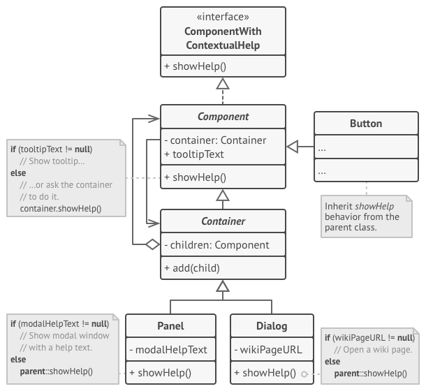
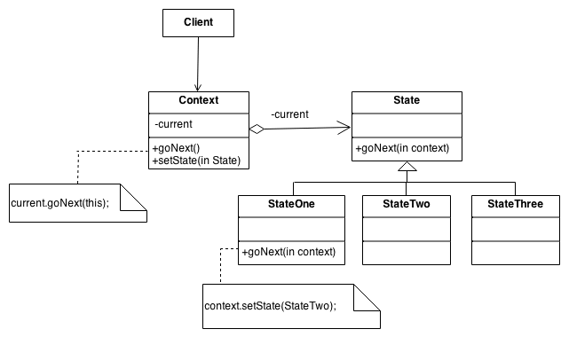

# GOF's Comportamentais

### Histórico de versão
| Data | Versão | Descrição | Autor(es) |
| ---- | ------ | --------- | --------- |
| 18/10/2019 | 0.1 | Criação do documento | Henrique Martins |
| 20/10/2019 | 0.2 | Adicionando imagens e benefícios para padrões | Henrique Martins |
| 23/10/2019 | 0.3 | Adição da introdução | Henrique Martins |
| 24/10/2019 | 0.4 | Adição Tópico Chain of Responsibility | Byron Kamal|
| 24/10/2019 | 0.5 | Adicao da Viabilidade do Command Pattern| Samuel Borges e Rafael Teodosio |
| 24/10/2019 | 0.6 | Adicao da Viabilidade do Iterator| Samuel Borges e Rafael Teodosio |

## Introdução

Os padrões comportamentais se concentram nos algoritmos e atribuições de responsabilidades entre os objetos. Eles não descrevem apenas padrões de classes ou de objetos, mas também os padrões de comunicação entre os objetos. Ao fazer isso, esses padrões aumentam a flexibilidade na realização dessa comunicação. Os padrões comportamentais de classes utilizam a herança para distribuir o comportamento entre classes, e os padrões de comportamento de objeto utilizam a composição de objetos em contrapartida a herança. Alguns descrevem como grupos de objetos cooperam para a execução de uma tarefa que não poderia ser executada por um objeto sozinho. Abaixo estão os padrões comportamentais.

---

## Chain of Responsibility

### O que é?

Chain of Responsibility é um padrão cuja principal função é evitar a dependência entre um objeto receptor e um objeto solicitante. Consiste em uma série de objetos receptores e de objetos de solicitação, onde cada objetos de solicitação possui uma lógica interna que separa quais são tipos de objetos receptores que podem ser manipulados. O restante é passado para o próximo objetos de solicitação da cadeia.

### Estrutura mínima

### Benefícios

 1. Reduz o grau de acoplamento. A dissociação solicitará o remetente e o destinatário.
 1. Objeto simplificado. O objeto não precisa conhecer a estrutura da cadeia.
 1. Aprimora a flexibilidade das tarefas atribuídas a objetos. Alterando os membros da cadeia ou alterando sua ordem, permita adicionar ou excluir responsabilidades dinamicamente.
 1. Aumenta a solicitação de processamento de nova classe de muito conveniente.

### Aplicável no Driblô?

 Está solução é aplicavél ao Driblô. 
 O caso de uso desse padrão no ecossistema do <strong>NodeJS</strong> é o <strong>middleware</strong> do <strong>ExpressJS</strong> Com esse padrão, é configurado uma cadeia de funções (middlewares) que avaliam o objeto de solicitação e decidem agir ou ignorá-lo.
 

 

 Middlewares são uma implementação específica desse padrão, pois, em vez de apenas um membro da cadeia atender à solicitação, pode-se argumentar que todos eles poderiam fazê-lo. Esse padrão trabalha assíncrona, onde, em vez de verificar se a função retorna um valor ou não, é verificado quais valores são passados ​​para o próximo callback que eles chamam.  
A seguir temos um trecho de código onde o <strong>middlaware</strong> é aplicado:
 

 

 

--------

## Command

### O que é?

Command é um padrão no qual um objeto é usado para encapsular toda informação necessária para executar uma ação ou acionar um evento em um momento posterior.

### Estrutura mínima

### Problemas solucionados pelo padrão

 1. Como o acoplamento de um pedido a um pedido pode ser evitado?
 1. Como um objeto pode ser configurado com uma solicitação?

### Benefícios

 1. Torna o código extensível, pois é possível adicionar novos comandos sem alterar o código existente.
 1. Reduz o acoplamento do invocador e receptor de um comando.

### Aplicável no Driblô?

| Problema | Solução é útil ao Driblô? |
| ------- | :-----: |
| Problema 1 |  | 
| Usuário pode mudar de ideia em relação às informações passadas anteriormente.| Sim, pois facilitar a implementação de um sistema de desfazimento de ações seria bastante pertinente ao projeto. | 
| Problema 2 |  |
| Projeto visa entregar o minimo produto viável e crescer conforme necessário. | Sim, pois facilitar a adição de comandos novos ajudaria no desenvolvimento. |

---

## Interpreter

### O que é?

Interpreter é um dos padrões de projeto de software, famosos como "Design Patterns", muito utilizado para a resolução de problemas quando a modelagem de sistemas ou softwares. Esse padrão esta incluso na categoria de Padrão Comportamental, ou seja, ele busca solucionar problemas de modelagem que tratam o comportamento de classes.

(Imagem de exemplo)

### Estrutura mínima

### Problemas solucionados pelo padrão

 1. Como pode ser definida uma gramática para um idioma simples para que as frases no idioma possam ser interpretadas?

### Benefícios

 1. É fácil alterar e estender a gramática. Como o padrão usa classes para representar regras gramaticais, você pode usar a herança para alterar ou estender a gramática. As expressões existentes podem ser modificadas incrementalmente, e novas expressões podem ser definidas como variações das antigas.
 1. A implementação da gramática também é fácil. As classes que definem nós na árvore de sintaxe abstrata têm implementações semelhantes. Essas classes são fáceis de escrever e geralmente sua geração pode ser automatizada com um compilador ou gerador de analisador.

### Aplicável no Driblô?

As intenções e os problemas resolvidos pelo Interpreter não possuem nenhum benefício ao Driblô, portanto não será aplicado.

---

## Iterator

### O que é?

No Iterator um iterador é usado para percorrer um container e acessar seus elementos. O padrão Iterator desacopla os algoritmos dos recipientes, porém em alguns casos, os algoritmos são necessariamente específicos dos containers e, portanto, não podem ser desacoplados.

### Estrutura mínima

### Problemas solucionados pelo padrão

 1. Como os elementos de um objeto agregado podem ser acessados e percorridos sem expor sua representação subjacente?

### Benefícios

 1. Princípio de responsabilidade única. Você pode limpar o código do cliente e as coleções extraindo algoritmos volumosos volumosos em classes separadas.
 1. Princípio Aberto / Fechado. Você pode implementar novos tipos de coleções e iteradores e passá-los para o código existente sem quebrar nada.
 1. Você pode iterar sobre a mesma coleção em paralelo porque cada objeto iterador contém seu próprio estado de iteração.
 1. Pelo mesmo motivo, você pode atrasar uma iteração e continuar quando necessário.

### Aplicável no Driblô?

| Problema | Solução é útil ao Driblô? |
| ------- | :-----: |
| Acessar e percorrer os elementos de um objeto sem expor sua representação subjacente.| Não é aplicável ao projeto pois a tecnologia utilizada para desenvolvimento já disponibiliza métodos que resolvem os problemas de natureza semelhante existentes. |

---

## Mediator

### O que é?

Mediador é um padrão de projeto usado frequentemente quando deseja-se encapsular como os objetos interagem, ou seja, a comunicação entre os objetos é estabelecida através do Mediator. Este padrão é considerado um padrão comportamental, pois o padrão pode alterar o comportamento da aplicação (programa).O Mediator promove o fraco acoplamento ao evitar que objetos se referiram uns aos outros explicitamente.

### Estrutura mínima

### Problemas solucionados pelo padrão

 1. Como evitar o acoplamento rígido entre um conjunto de objetos em interação?
 2. Como a interação entre um conjunto de objetos pode ser alterada independentemente?

### Benefícios

 1. Diminuí consideravelmente o acoplamento (entre os Colegas) e consequentemente aumenta o reuso.
 1. Ocorre a eliminação de relacionamentos muitos para muitos (N para N)
 1. A política de comunicações fica centralizada no Mediator, logo, podemos alterar essa política sem precisar alterar os Colegas. 

### Aplicável no Driblô?

| Problema | Solução é útil ao Driblô? |
| ------- | :-----: |
| Problema 1 | Sim |
| Problema 2 | Sim |

(Dizer porque soluções são úteis ou não)

Na modelagem do banco de dados, é possível ver que a entidade de usuário está ligada a todas outras entidades do banco, além de possuir relacionamentos N para N, o que pode trazer um acoplamento forte dessa classe, assim o mediator se torna uma solução para esses problema, um exemplo seria quando o usuário participa da pelada deve existir um mediador entre usuário e a pelada.  

---

## Memento

### O que é?

Memento é um padrão de projeto de software documentado no Catálogo Gang of Four, sendo considerado como um padrão comportamental. Ele permite armazenar o estado interno de um objeto em um determinando momento, para que seja possível retorná-lo a este estado, sem que isso cause problemas com o encapsulamento.

### Estrutura mínima

### Problemas solucionados pelo padrão

 1. Sem violar o encapsulamento, como o estado interno de um objeto pode ser capturado e externalizado para que o objeto possa ser restaurado para esse estado posteriormente?

### Benefícios

 1. Você pode produzir snapshots do estado do objeto sem violar seu encapsulamento.
 1. Você pode simplificar o código do autor, deixando o responsável manter o histórico do estado do autor.

### Aplicável no Driblô?

| Problema | Solução é útil ao Driblô? |
| ------- | :-----: |
| Problema 1 |  |

(Dizer porque soluções são úteis ou não)

---

## Observer

### O que é?

O Observer é um padrão de projeto de software que define uma dependência um-para-muitos entre objetos de modo que quando um objeto muda o estado, todos seus dependentes são notificados e atualizados automaticamente. Permite que objetos interessados sejam avisados da mudança de estado ou outros eventos ocorrendo num outro objeto.

### Estrutura mínima

### Problemas solucionados pelo padrão

 1. Como uma dependência de um para muitos entre objetos pode ser definida sem tornar os objetos fortemente acoplados?
 1. Como um objeto pode notificar um número ilimitado de outros objetos?

### Benefícios

 1. Princípio Aberto / Fechado.
 1. Você pode estabelecer relações entre objetos em tempo de execução.

### Aplicável no Driblô?

| Problema | Solução é útil ao Driblô? |
| ------- | :-----: |
| Problema 1 |  |
| Problema 2 |  |

(Dizer porque soluções são úteis ou não)

---

## State

### O que é?

State é um padrão de projeto de software usado quando o comportamento de um objeto muda, dependendo do seu estado.

### Estrutura mínima

### Problemas solucionados pelo padrão

 1. Como um objeto pode alterar seu comportamento quando seu estado interno muda?
 1. Como o comportamento específico do estado pode ser definido para que novos estados possam ser adicionados e o comportamento dos estados existentes possa ser alterado independentemente?

### Benefícios

 1. Princípio de responsabilidade única. Organize o código relacionado a estados específicos em classes separadas.
 1. Princípio Aberto / Fechado. Introduzir novos estados sem alterar as classes de estado existentes ou o contexto.
 1. Simplifique o código do contexto, eliminando condicionais volumosos da máquina de estado.

### Aplicável no Driblô?

| Problema | Solução é útil ao Driblô? |
| ------- | :-----: |
| Problema 1 |  |
| Problema 2 |  |

(Dizer porque soluções são úteis ou não)

---

## Strategy

### O que é?

O padrão de estratégia é um padrão comportamental que permite selecionar um algoritmo em tempo de execução. Em vez de implementar um único algoritmo diretamente, o código recebe instruções em tempo de execução sobre as quais em uma família de algoritmos usar.

### Estrutura mínima

### Problemas solucionados pelo padrão

 1. Como uma classe pode ser configurada com um algoritmo em tempo de execução, em vez de implementar um algoritmo diretamente?
 1. Como um algoritmo pode ser selecionado e trocado em tempo de execução?

### Benefícios

 1. Você pode trocar algoritmos usados dentro de um objeto em tempo de execução.
 1. Você pode isolar os detalhes de implementação de um algoritmo do código que o utiliza.
 1. Você pode substituir herança por composição.
 1. Princípio Aberto / Fechado. Você pode introduzir novas estratégias sem precisar alterar o contexto.

### Aplicável no Driblô?

| Problema | Solução é útil ao Driblô? |
| ------- | :-----: |
| Problema 1 |  |
| Problema 2 |  |

(Dizer porque soluções são úteis ou não)

---

## Template Method

### O que é?

O template method é um dos padrões de design comportamental. O template method é um método em uma superclasse, geralmente uma superclasse abstrata, e define o esqueleto de uma operação em termos de várias etapas de alto nível. Essas etapas são implementadas por métodos auxiliares adicionais na mesma classe que o template method.

### Estrutura mínima

### Problemas solucionados pelo padrão

 1. Como as partes invariantes de um comportamento podem ser implementadas uma vez para que as subclasses possam implementar as partes variantes?
 1. Como as subclasses podem redefinir certas partes de um comportamento sem alterar a estrutura do comportamento?

### Benefícios

 1. Você pode permitir que os clientes substituam apenas certas partes de um algoritmo grande, tornando-os menos afetados pelas alterações que acontecem com outras partes do algoritmo.
 1. Você pode colocar o código duplicado em uma superclasse.

### Aplicável no Driblô?

| Problema | Solução é útil ao Driblô? |
| ------- | :-----: |
| Problema 1 |  |
| Problema 2 |  |

(Dizer porque soluções são úteis ou não)

---

## Visitor

### O que é?

O padrão de design Visitor é uma maneira de separar um algoritmo de uma estrutura de objeto na qual ele opera. Um resultado prático dessa separação é a capacidade de adicionar novas operações às estruturas de objetos existentes sem modificar as estruturas.

### Estrutura mínima

### Problemas solucionados pelo padrão

 1. Como novas operações podem ser definidas para as classes de uma estrutura de objetos sem alterar as classes?

### Benefícios

 1. Princípio Aberto / Fechado. Você pode introduzir um novo comportamento que possa trabalhar com objetos de diferentes classes sem alterar essas classes.
 1. Princípio de responsabilidade única. Você pode mover várias versões do mesmo comportamento para a mesma classe.
 1. Um objeto visitante pode acumular algumas informações úteis ao trabalhar com vários objetos. Isso pode ser útil quando você deseja percorrer alguma estrutura complexa de objetos, como uma árvore de objetos, e aplicar o visitante a cada objeto dessa estrutura.

### Aplicável no Driblô?

| Problema | Solução é útil ao Driblô? |
| ------- | :-----: |
| Problema 1 |  |

(Dizer porque soluções são úteis ou não)

---

### Referências

[Wikipédia - Padrão de projeto de software](https://pt.wikipedia.org/wiki/Padr%C3%A3o_de_projeto_de_software)

[Source Making - Behavioral patterns](https://sourcemaking.com/design_patterns/behavioral_patterns)

[Wikipédia - Chain of Responsibility](https://pt.wikipedia.org/wiki/Chain_of_Responsibility)

[GeeksforGeeks - Chain of Responsibility](https://www.geeksforgeeks.org/chain-responsibility-design-pattern/)

[Refactoring Guru - Chain of Responsibility](https://refactoring.guru/design-patterns/chain-of-responsibility)

[Wikipédia - Command](https://pt.wikipedia.org/wiki/Command)

[Source Making - Command Design Pattern](https://sourcemaking.com/design_patterns/command)

[Refactoring Guru - Command](https://refactoring.guru/design-patterns/command)

[Wikipédia - Interpreter](https://pt.wikipedia.org/wiki/Interpreter)

[Wikipédia - Interpreter pattern](https://en.wikipedia.org/wiki/Interpreter_pattern)

[GeeksforGeeks - Interpreter Design Pattern](https://www.geeksforgeeks.org/interpreter-design-pattern/)

[Wikipédia - Iterador](https://pt.wikipedia.org/wiki/Iterador)

[Wikipédia - Iterator pattern](https://en.wikipedia.org/wiki/Iterator_pattern)

[Refactoring Guru - Iterator](https://refactoring.guru/design-patterns/iterator)

[Wikipédia - Mediator](https://pt.wikipedia.org/wiki/Mediator)

[Refactoring Guru - Mediator](https://refactoring.guru/design-patterns/mediator)

[Wikipédia - Memento (Informática)](https://pt.wikipedia.org/wiki/Memento_(inform%C3%A1tica))

[Source Making - Memento Design Pattern](https://sourcemaking.com/design_patterns/memento)

[Refactoring Guru - Memento](https://refactoring.guru/design-patterns/memento)

[Wikipédia - Observer](https://pt.wikipedia.org/wiki/Observer)

[Refactoring Guru - Observer](https://refactoring.guru/design-patterns/observer)

[Wikipédia - State](https://pt.wikipedia.org/wiki/State)

[Source Making - State Design Pattern](https://sourcemaking.com/design_patterns/state)

[Refactoring Guru - State](https://refactoring.guru/design-patterns/state)

[Wikipédia - Strategy pattern](https://en.wikipedia.org/wiki/Strategy_pattern)

[Refactoring Guru - Strategy](https://refactoring.guru/design-patterns/strategy)

[Wikipédia - Template method pattern](https://en.wikipedia.org/wiki/Template_method_pattern)

[Refactoring Guru - Template Method](https://refactoring.guru/design-patterns/template-method)

[Wikipédia - Visitor pattern](https://en.wikipedia.org/wiki/Visitor_pattern)

[Refactoring Guru - Visitor](https://refactoring.guru/design-patterns/visitor)

[w3sDesign](http://w3sdesign.com/?gr=s02&ugr=proble#gf)