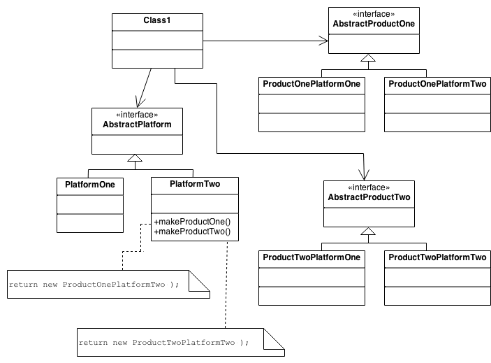
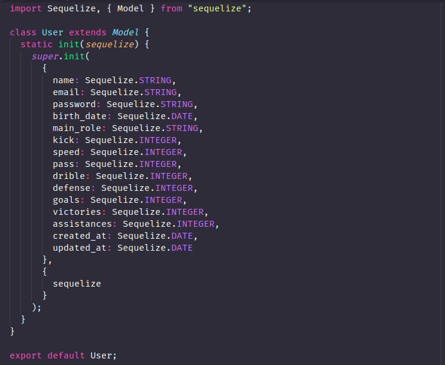

# GOF's Criacionais

### Histórico de versão
| Data | Versão | Descrição | Autor(es) |
| ---- | ------ | --------- | --------- |
| 18/10/2019 | 0.1 | Criação do documento | Henrique Martins |
| 23/10/2019 | 0.2 | Adicionando imagens e benefícios para padrões | Henrique Martins |
| 23/10/2019 | 0.3 | Adição da introdução | Henrique Martins |
| 24/10/2019 | 0.4 | Adição dos problemas solucionados pelos padrões | Henrique Martins |
| 24/10/2019 | 0.5 | Adição exemplo de padrão factory-method driblo| Luís Cláudio T. Lima |
| 24/10/2019 | 0.6 | Adição da viabilidade ao projeto do modelo Abstract Factory| Rafael Teodosio, Samuel Borges |

## Introdução

Os padrões de criacionais são padrões de que lidam com mecanismos de criação de objetos, tentando criar objetos de maneira adequada à situação. Eles ajudam a tornar um sistema independente de como seus objetos são criados, compostos e representados. Um padrão de criação de classe usa a herança para variar a classe que é instanciada, enquanto que um padrão de criação de objeto delegará a instanciação para outro objeto. Os padrões criacionais tornam-se importantes à medida que os sistemas evoluem no sentido de dependerem mais da composição de objetos do que a herança de classes.

---

## Abstract Factory

### O que é?

Este padrão permite a criação de famílias de objetos relacionados ou dependentes por meio de uma única interface e sem que a classe concreta seja especificada. Uma fábrica é a localização de uma classe concreta no código em que objetos são construídos.

### Estrutura mínima

### Problemas solucionados pelo padrão

 1. Como um aplicativo pode ser independente de como seus objetos são criados?
 2. Como uma classe pode ser independente de como os objetos que ela exige são criados?
 3. Como as famílias de objetos relacionados ou dependentes podem ser criadas?

### Benefícios

 1. Isolamento de classes concretas
 1. Troca fácil de famílias de produtos
 1. Promove consistência entre produtos

### Aplicável no Driblô?

| Problema | Solução é útil ao Driblô? |
| ------- | :-----: |
| Como um aplicativo pode ser independente de como seus objetos são criados? | Não, pois no escopo do projeto nao há a necessidade da criação de aplicativos indendentes aos objetos  | 
| Como uma classe pode ser independente de como os objetos que ela exige são criados? | Não, pois as tecnoligias utilizadas no projeto tanto no Back-End quanto no Front-End já fornecem a independencia dos objetos |
| Como as famílias de objetos relacionados ou dependentes podem ser criadas? | De acordo com o escopo do projeto não há necessidade da implementação de um Design Pattern para a criação de famílias de objetos relacionados |

---

## Builder

### O que é?

Builder é um padrão criacional que permite a separação da construção de um objeto complexo da sua representação, de forma que o mesmo processo de construção possa criar diferentes representações.

### Estrutura mínima

### Problemas solucionados pelo padrão

 1. Como uma classe (o mesmo processo de construção) pode criar representações diferentes de um objeto complexo?
 2. Como uma classe que inclui a criação de um objeto complexo pode ser simplificada?

### Benefícios

 1. Permite variar a representação interna de um produto.
 1. Encapsula código para construção e representação.
 1. Fornece controle sobre as etapas do processo de construção.

### Aplicável no Driblô?

| Problema | Solução é útil ao Driblô? |
| ------- | :-----: |
| Problema 1 |  | 
| Problema 2 |  |

(Dizer porque soluções são úteis ou não)

---

## Factory Method

### O que é?

Factory Method é um padrão de projeto de software que permite às classes delegar para subclasses decidirem, isso é feito através da criação de objetos que chamam o método fabrica especificado numa interface e implementado por um classe filha ou implementado numa classe abstrata e opcionalmente sobrescrito por classes derivadas.

### Estrutura mínima

### Benefícios

 1. Permite a construção de classes com um componente de um tipo que não foi predeterminado, mas definido apenas em uma "interface" ou definido como um tipo dinâmico.
 1. Permite a construção de subclasses para um pai cujo tipo de componente não foi predeterminado, mas definido apenas em uma interface ou definido como um tipo dinâmico.
 1. Permite um código mais legível nos casos em que existem vários construtores, cada um por um motivo diferente.
 1. Permite que uma classe adie a instanciação para subclasses e evite a instanciação direta de um objeto do tipo de classe pai.

### Aplicável no Driblô?

---

## Prototype

### O que é?

Prototype é um padrão de projeto de software criacional que permite a criação de novos objetos a partir de um modelo original ou protótipo que é clonado.

### Estrutura mínima

### Problemas solucionados pelo padrão

 1. Como os objetos podem ser criados para que os objetos a serem criados possam ser especificados em tempo de execução?
 1. Como as classes carregadas dinamicamente podem ser instanciadas?

### Benefícios

 1. Você pode clonar objetos sem acoplar às suas classes concretas.
 1. Você pode se livrar do código de inicialização repetido em favor da clonagem de protótipos pré-criados.
 1. Você pode produzir objetos complexos de forma mais conveniente.
 1. Você obtém uma alternativa à herança ao lidar com predefinições de configuração para objetos complexos.

### Aplicável no Driblô?

| Problema | Solução é útil ao Driblô? |
| ------- | :-----: |
| Problema 1 | Não | 
| Problema 2 | Não |

(Dizer porque soluções são úteis ou não)
 
O padrão prototype é usando quando a necessidade de especificar o tipo de objeto instaciado em tempo de execução, o que não será necessário no Driblô.

---

## Singleton

### O que é?

Singleton é um padrão de projeto de software que garante a existência de apenas uma instância de uma classe, mantendo um ponto global de acesso ao seu objeto.

### Estrutura mínima

### Problemas solucionados pelo padrão

 1. Como é possível garantir que uma classe tenha apenas uma instância?
 1. Como a instância única de uma classe pode ser acessada facilmente?
 1. Como uma classe pode controlar sua instanciação?
 1. Como o número de instâncias de uma classe pode ser restrito?

### Benefícios

 1. Você pode ter certeza de que uma classe possui apenas uma única instância.
 1. Você ganha um ponto de acesso global para essa instância.
 1. O objeto singleton é inicializado somente quando solicitado pela primeira vez.

### Aplicável no Driblô?

| Problema | Solução é útil ao Driblô? |
| ------- | :-----: |
| Problema 1 |  | 
| Problema 2 |  |
| Problema 3 |  | 
| Problema 4 |  |

(Dizer porque soluções são úteis ou não)

---

### Referências

[Wikipédia - Padrão de projeto de software](https://pt.wikipedia.org/wiki/Padr%C3%A3o_de_projeto_de_software)

[Source Making - Creational patterns](https://sourcemaking.com/design_patterns/creational_patterns)

[Wikipédia - Abstract Factory](https://pt.wikipedia.org/wiki/Abstract_Factory)

[GeeksforGeeks - Abstract Factory Pattern](https://www.geeksforgeeks.org/abstract-factory-pattern/)

[Source Making - Abstract Factory Design Pattern](https://sourcemaking.com/design_patterns/abstract_factory)

[Refactoring Guru - Abstract Factory](https://refactoring.guru/design-patterns/abstract-factory)

[Wikipédia - Abstract factory pattern](https://en.wikipedia.org/wiki/Abstract_factory_pattern)

[Wikipédia - Builder](https://pt.wikipedia.org/wiki/Builder)

[Wikipédia - Builder pattern](https://en.wikipedia.org/wiki/Builder_pattern)

[Refactoring Guru - Builder](https://refactoring.guru/design-patterns/builder)

[Wikipédia - Factory Method](https://pt.wikipedia.org/wiki/Factory_Method)

[Wikipédia - Factory method pattern](https://en.wikipedia.org/wiki/Factory_method_pattern)

[Refactoring Guru - Factory Method](https://refactoring.guru/design-patterns/factory-method)

[Wikipédia - Prototype](https://pt.wikipedia.org/wiki/Prototype)

[Wikipédia - Prototype pattern](https://en.wikipedia.org/wiki/Prototype_pattern)

[Refactoring Guru - Prototype](https://refactoring.guru/design-patterns/prototype)

[Wikipédia - Singleton](https://pt.wikipedia.org/wiki/Singleton)

[Wikipédia - Singleton pattern](https://en.wikipedia.org/wiki/Singleton_pattern)

[Refactoring Guru - Singleton](https://refactoring.guru/design-patterns/singleton)

[w3sDesign](http://w3sdesign.com/?gr=s02&ugr=proble#gf)