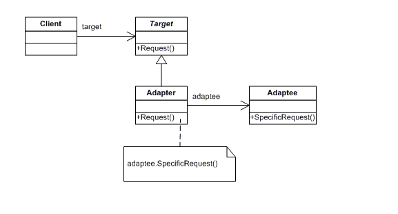

# GOF's Estruturais

### Histórico de versão
| Data | Versão | Descrição | Autor(es) |
| ---- | ------ | --------- | --------- |
| 18/10/2019 | 0.1 | Criação do documento | Henrique Martins |
| 23/10/2019 | 0.2 | Adicionando imagens e benefícios para padrões | Henrique Martins |

## Introdução

(Acrescentar)

---

## Adapter

### O que é?

O padrão do adaptador é um padrão de design de software que permite que a interface de uma classe existente seja usada como outra interface. É frequentemente usado para fazer com que as classes existentes funcionem com outras pessoas sem modificar seu código-fonte.

### Estrutura mínima

### Problemas solucionados pelo padrão

 1. Como uma classe pode ser reutilizada que não possui uma interface que um cliente exige?
 1. Como as classes que possuem interfaces incompatíveis podem trabalhar juntas?
 1. Como uma interface alternativa pode ser fornecida para uma classe?

### Benefícios

 1. Princípio de responsabilidade única. Você pode separar a interface ou o código de conversão de dados da lógica de negócios principal do programa.
 1. Princípio Aberto / Fechado. Você pode introduzir novos tipos de adaptadores no programa sem quebrar o código do cliente existente, desde que eles funcionem com os adaptadores por meio da interface do cliente.

### Aplicável no Driblô?

| Problema | Solução é útil ao Driblô? |
| ------- | :-----: |
| Problema 1 |  | 
| Problema 2 |  |
| Problema 3 |  |

(Dizer porque soluções são úteis ou não)

---

## Bridge

### O que é?

O Bridge é um padrão de design destinado a "desacoplar uma abstração de sua implementação, para que os dois possam variar independentemente". O Bridge usa encapsulamento, agregação e pode usar herança para separar responsabilidades em diferentes classes.

### Estrutura mínima

### Problemas solucionados pelo padrão

 1. A
 1. B

### Benefícios

 1. Você pode criar classes e aplicativos independentes de plataforma.
 1. O código do cliente funciona com abstrações de alto nível. Não está exposto aos detalhes da plataforma.
 1. Princípio Aberto / Fechado. Você pode introduzir novas abstrações e implementações independentemente uma da outra.
 1. Princípio de responsabilidade única. Você pode se concentrar na lógica de alto nível na abstração e nos detalhes da plataforma na implementação.

### Aplicável no Driblô?

| Problema | Solução é útil ao Driblô? |
| ------- | :-----: |
| Problema 1 |  | 
| Problema 2 |  |

(Dizer porque soluções são úteis ou não)

---

## Composite

### O que é?

Composite é um padrão de projeto de software utilizado para representar um objeto formado pela composição de objetos similares. Este conjunto de objetos pressupõe uma mesma hierarquia de classes a que ele pertence. Tal padrão é, normalmente, utilizado para representar listas recorrentes - ou recursivas - de elementos. Além disso, este modo de representação hierárquica de classes permite que os elementos contidos em um objeto composto sejam tratados como se fossem um objeto único. Desta forma, os métodos comuns às classes podem ser aplicados, também, ao conjunto agrupado no objeto composto.

### Estrutura mínima

### Problemas solucionados pelo padrão

 1. A
 1. B

### Benefícios

 1. Você pode trabalhar com estruturas de árvores complexas de maneira mais conveniente: use polimorfismo e recursão a seu favor.
 1. Princípio Aberto / Fechado. Você pode introduzir novos tipos de elementos no aplicativo sem quebrar o código existente, que agora funciona com a árvore de objetos.

### Aplicável no Driblô?

| Problema | Solução é útil ao Driblô? |
| ------- | :-----: |
| Problema 1 |  | 
| Problema 2 |  |

(Dizer porque soluções são úteis ou não)

---

## Decorator

### O que é?

Decorator é um padrão de projeto que permite adicionar um comportamento a um objeto já existente em tempo de execução, ou seja, agrega dinamicamente responsabilidades adicionais a um objeto. Decorators oferecem uma alternativa flexível ao uso de herança para estender uma funcionalidade, com isso adiciona-se uma responsabilidade ao objeto e não à classe.

### Estrutura mínima

### Problemas solucionados pelo padrão

 1. A
 1. B

### Benefícios

 1. Você pode estender o comportamento de um objeto sem criar uma nova subclasse.
 1. Você pode adicionar ou remover responsabilidades de um objeto em tempo de execução.
 1. Você pode combinar vários comportamentos envolvendo um objeto em vários decoradores.
 1. Princípio de responsabilidade única. Você pode dividir uma classe monolítica que implementa muitas variantes possíveis de comportamento em várias classes menores.

### Aplicável no Driblô?

| Problema | Solução é útil ao Driblô? |
| ------- | :-----: |
| Problema 1 |  | 
| Problema 2 |  |

(Dizer porque soluções são úteis ou não)

---

## Facade

### O que é?

O Padrão Façade é do tipo estrutural. É usado quando um sistema é muito complexo ou difícil de entender, já que possui um grande número de classes independentes ou se trechos de código fonte estão indisponíveis. Este padrão esconde as complexidades de um sistema maior e provê uma interface simplificada ao cliente. Tipicamente envolve uma única classe responsável por englobar uma série de membros requeridos pelo cliente. Estes membros acessam o sistema em nome do Façade e escondem os detalhes de implementação. 

### Estrutura mínima

### Problemas solucionados pelo padrão

 1. A
 1. B

### Benefícios

 1. Você pode isolar seu código da complexidade de um subsistema.

### Aplicável no Driblô?

| Problema | Solução é útil ao Driblô? |
| ------- | :-----: |
| Problema 1 |  | 
| Problema 2 |  |

(Dizer porque soluções são úteis ou não)

---

## Flyweight

### O que é?

Flyweight é apropriado quando vários objetos devem ser manipulados em memória sendo que muitos deles possuem informações repetidas. Dado que o recurso de memória é limitado, é possível segregar a informação repetida em um objeto adicional que atenda as características de imutabilidade e comparabilidade (que consiga ser comparado com outro objeto para determinar se ambos carregam a mesma informação).

### Estrutura mínima

### Problemas solucionados pelo padrão

 1. A
 1. B

### Benefícios

 1. Você pode economizar muita memória RAM, assumindo que seu programa tenha vários objetos semelhantes.

### Aplicável no Driblô?

| Problema | Solução é útil ao Driblô? |
| ------- | :-----: |
| Problema 1 |  | 
| Problema 2 |  |

(Dizer porque soluções são úteis ou não)

---

## Proxy

### O que é?

Proxy é um padrão estrutural que permite fornecer um substituto ou espaço reservado para outro objeto. Um proxy controla o acesso ao objeto original, permitindo que você execute algo antes ou depois que a solicitação chega ao objeto original.

### Estrutura mínima

### Problemas solucionados pelo padrão

 1. A
 1. B

### Benefícios

 1. Você pode controlar o objeto de serviço sem que os clientes saibam disso.
 1. Você pode gerenciar o ciclo de vida do objeto de serviço quando os clientes não se importam com isso.
 1. O proxy funciona mesmo que o objeto de serviço não esteja pronto ou não esteja disponível.
 1. Princípio Aberto / Fechado. Você pode introduzir novos proxies sem alterar o serviço ou os clientes.

### Aplicável no Driblô?

| Problema | Solução é útil ao Driblô? |
| ------- | :-----: |
| Problema 1 |  | 
| Problema 2 |  |

(Dizer porque soluções são úteis ou não)

---

### Referências

[Wikipédia - Adapter](https://pt.wikipedia.org/wiki/Adapter)

[Wikipédia - Adapter pattern](https://en.wikipedia.org/wiki/Adapter_pattern)

[Refactoring Guru - Adapter](https://refactoring.guru/design-patterns/adapter)

[Wikipédia - Bridge pattern](https://en.wikipedia.org/wiki/Bridge_pattern)

[Refactoring Guru - Bridge](https://refactoring.guru/design-patterns/bridge)

[Wikipédia - Composite](https://pt.wikipedia.org/wiki/Composite)

[Refactoring Guru - Composite](https://refactoring.guru/design-patterns/composite)

[Wikipédia - Decorator](https://pt.wikipedia.org/wiki/Decorator)

[Refactoring Guru - Decorator](https://refactoring.guru/design-patterns/decorator)

[Wikipédia - Façade](https://pt.wikipedia.org/wiki/Fa%C3%A7ade)

[Wikipédia - Facade pattern](https://en.wikipedia.org/wiki/Facade_pattern)

[Refactoring Guru - Facade](https://refactoring.guru/design-patterns/facade)

[Wikipédia - Business_delegate](https://pt.wikipedia.org/wiki/Business_delegate)

[Wikipédia - Flyweight](https://pt.wikipedia.org/wiki/Flyweight)

[Refactoring Guru - Flyweight](https://refactoring.guru/design-patterns/flyweight)

[Wikipédia - Proxy pattern](https://en.wikipedia.org/wiki/Proxy_pattern)

[Refactoring Guru - Proxy](https://refactoring.guru/design-patterns/proxy)