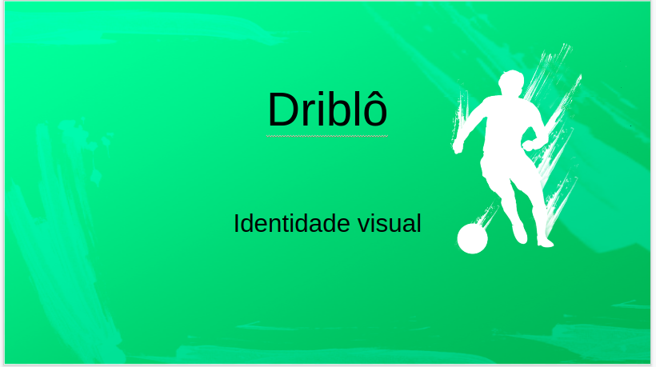

#### Histórico de versão

| Data       | Versão | Descrição            | Autor(es)       |
| ---------- | ------ | -------------------- | --------------- |
| 05/08/2019 | 0.1 | Criação de documento e adição tópicos 1, 2, 3 | Caio Oliveira |

## 1.Introdução
Identidade visual é o documento onde é aprensentado as escolhas visuais da aplicação, como cores fontes e a logo do projeto
## 2.Link para a apresentação

