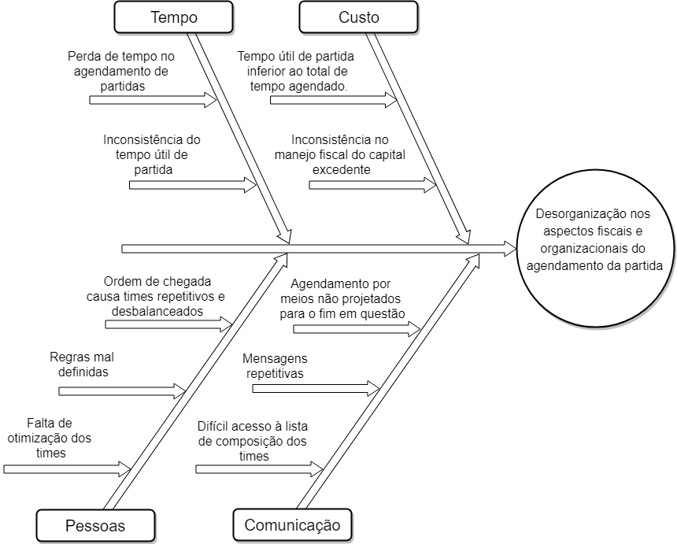

# Histórico de Versão

|    Data    |              Autor(es)              |          Descrição           | Versão |
| :--------: | :---------------------------------: | :--------------------------: | :----: |
| 19/08/2019 | Rafael Santos, Samuel Barros Borges |     Criação do documento     |  0.1   |
| 22/08/2019 |             Byron Kamal             | Adição dos tópicos 2, 3, e 5 |  0.2   |

## 1. Introdução

O Diagrama de Causa-Efeito, também chamado de “Diagrama de Ishikawa” ou Diagrama de Espinha de Peixe, tem como objetivo identificar as causas de problemas que devem ser resolvidos através de uma representação gráfica.

## 2.Objetivo

Este documento tem como objetivo mostrar algumns dos principais problemas enfrentados para organizar uma partida de futebol informal, utilizando o Diagrama de Causa-Efeito.

## 3.Metodologia

Alguns integrantes do grupo ficaram responsáveis pela produção do Diagrama Causa-Efeito, sendo que eles froam produzidos com o auxílio da ferrementa Draw.io.

## 4. Diagramas

Diagrama de causa e efeito representando as possiveis dificuldades encontradas no processo de marcar uma partidada de futebol amador.  

**Versão 1.0**

## 5.Conclusão

O uso do Diagrama de Ishikawa ajuda a manter essas atividades em constante aprimoramento e facilita a solução dos seus problemas elevando o nível de compreensão da equipe sobre o problema a ser resolvido.

## 6.Referências

- O QUE É E COMO FAZER UM DIAGRAMA DE ISHIKAWA? Disponível em: https://www.siteware.com.br/metodologias/diagrama-de-ishikawa.
- Diagrama de Ishikawa. Disponível em: https://blogdaqualidade.com.br/diagrama-de-ishikawa.
