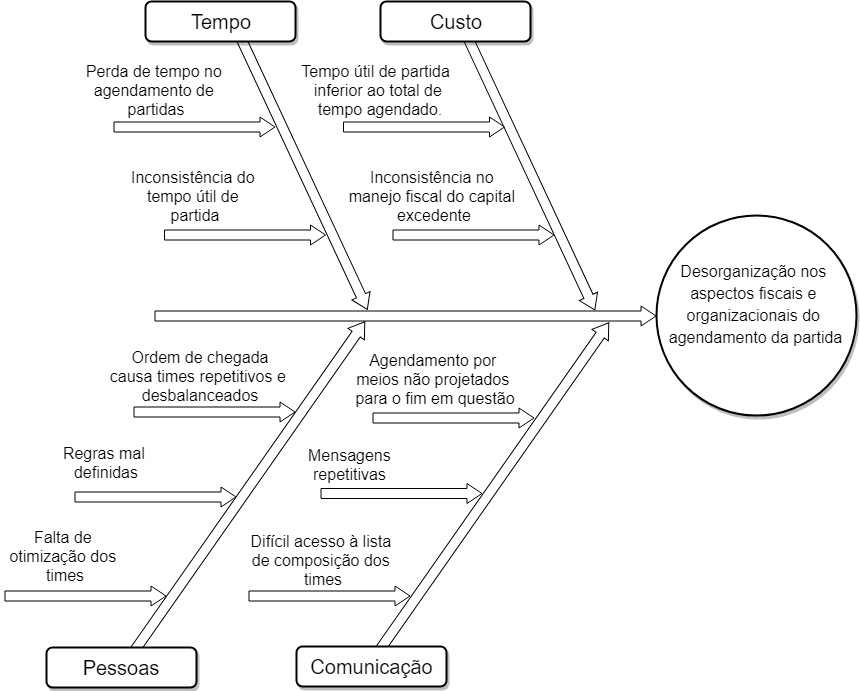
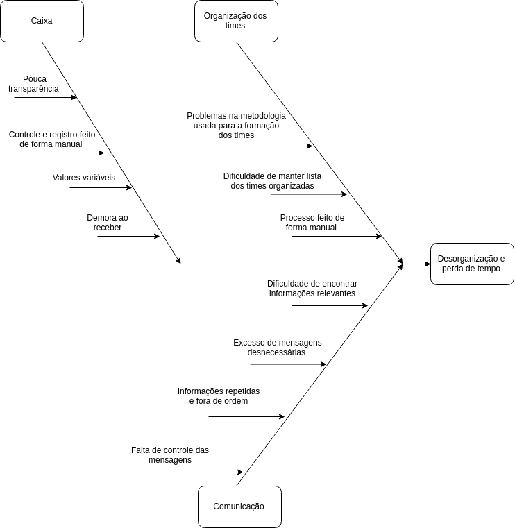

#### Histórico de Versão

| Data | Autor(es) | Descrição | Versão |
|:-----:|:-------:|:-------:|:-------:|
|19/08/2019| Rafael Santos, Samuel Barros Borges| Criação do documento |0.1
|22/08/2019| Marcelo Magalhães| Adição da versão 1.1 do diagrama de causa e efeito |0.2

## 1. Introdução

O Diagrama de Causa e Efeito, também chamado de “Diagrama de Ishikawa”, tem como objetivo identificar as causas de problemas que devem ser resolvidos através de uma representação gráfica.

## 2. Diagramas

Diagrama de causa e efeito representando as possíveis dificuldades encontradas no processo de marcar uma partida de futebol amador.

### Versão 1.0

### Versão 1.1

