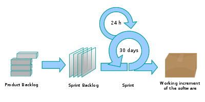

#### Histórico de versão

|    Data    | Versão |                Descrição                |                                                  Autor(es)                                                   |
| :--------: | :----: | :-------------------------------------: | :----------------------------------------------------------------------------------------------------------: |
| 5/09/2019 |  0.1   |          Criação do documento           | Byron Kamal, Caio Oliveira, Matheus Rodrigues |

## 1.Introdução

O documento de metodologia tem por finalidade demonstrar quais aspectos das metodologias já conhecidas serão usadas para o desenvolvimento do projeto Driblo, os aspectos foram discutidos e aprovados pelo grupo durantes as reuniões.

## 2.Objetivo

Apresentar como será o funcionamento da equipe, em relação a metodologia usada para o desenvolvimento do aplicativo Driblo.

## 3.Metodologia

O grupo se reuniu-se durante as aulas da disciplina e conversou quais aspectos seriam importantes para o desenvolvimento do projeto.

## 4. Scrum

O scrum é uma metodologia ágil para a gestão de projetos de software. Tipicamente o scrum tem como pilares 3 regras, o uso de papéis, eventos e geração de artefatos.

#### Papéis

Existem 3 papéis no SCRUM o Product owner,Scrum master e dev. 
 - **O product owner** é responsável por manter o product backlog priorizado, visando dar valor de negocio ao projeto e passar a visão do que é o produto para todo o time. 
 - **Scrum master** é aquele que garante que os conceitos de scrum estejam sendo seguidos pela a equipe, direcionando o esforço para que o time atinja o máximo de performace durante o desenvolvimento do projeto, além de trabalhar com o PO para decidir atividades da sprint.
 - **Dev** é quem participa do time scrum, resposnsável por 
 desenvolver o projeto.  

#### Eventos

Os eventos são rituais feitos pelos membros da equipe para que o projeto possa ter uma melhor produtividade e 

- **Sprint** é o período de tempo definido para executar atividades propostas pelo PO e o scrum master.
- **Sprint Planning** é quando o PO e scrum master definem a partir do backlog o que será executado na sprint.
- **Sprint Review** reunião onde é feita a retrospectiva da sprint, levantando os pontos positivos e negativos para que possa haver uma maior produtividade da equipe.
- **Daily meeting** uma pequena reunião que acontece todos os dias para que os membros da equipe tenham um alinhamento em relação do que está acontecendo em todas as áreas do projeto.

#### Artefatos
Os artefatos gerados servem para que facilitar a visão e a produtividade do projeto.

 - **Product backlog**  lista que contém todas as funcionalidades desejada para o produto.
 - **Sprint backlog** lista com as funcionalidades que seram implementadas na sprint.

    