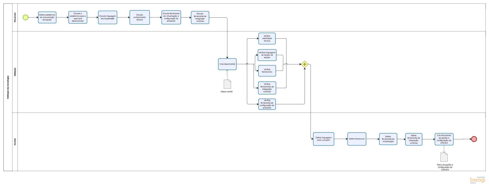
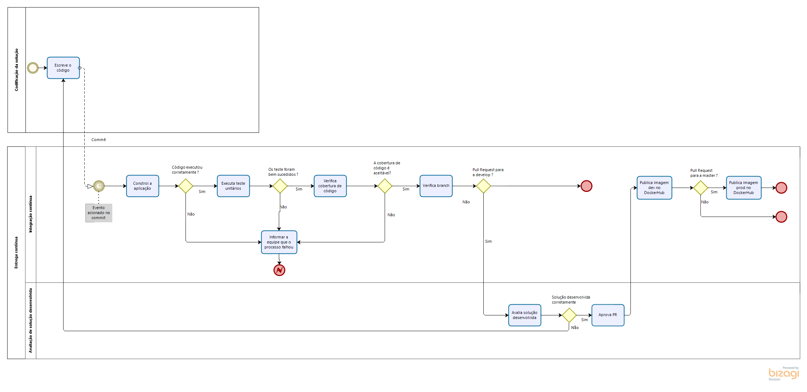

#### Histórico de versão

|    Data    | Versão |               Descrição               |                   Autor(es)                    |
| :--------: | :----: | :-----------------------------------: | :--------------------------------------------: |
| 5/09/2019  |  0.1   |         Criação do documento          | Byron Kamal, Caio Oliveira, Matheus Rodrigues  |
| 5/09/2019  |  0.2   |   Criação dos tópicos 1,2,3,4,5 e 6   | Byron Kamal, Caio Oliveira, Matheus Rodrigues  |
| 05/09/2019 |  0.3   | Tópico 7.1 - Diagrama de Metodologia  | Byron Kamal, Caio Oliveira e Marcelo Magalhães |
| 05/09/2019 | 0.3.1  | Tópico 7.2 - Diagrama Sprint Planning |        Byron Kamal e Marcelo Magalhães         |
| 05/09/2019 | 0.3.2  |  Tópico 7.3 - Diagrama Sprint Review  |                  Byron Kamal                   |
| 6/09/2019  |  0.4   |          Revisão ortógrafica          |                João Pedro Mota                 |
| 6/09/2019  |  0.5   |          Tópico 7.4 diagrama da decisão das tecnologias e tópico 7.5 diagrama da entrega contínua|                Matheus Rodrigues |
| 6/09/2019  |  0.6   |          Correção de erro             |                Henrique Martins                |
| 6/09/2019  |  0.7   |  Tópico 7.7 diagrama do seminário     |                Henrique Martins                |
| 6/09/2019  |  0.8   |  Tópico 7.8 diagrama do backlog do produto     |                Marcelo Araújo                |

## 1.Introdução

O documento de metodologia tem por finalidade demonstrar quais aspectos das metodologias já conhecidas serão usadas para o desenvolvimento do projeto Driblô, os aspectos foram discutidos e aprovados pelo grupo durantes as reuniões.

## 2.Objetivo

Apresentar como será o funcionamento da equipe, em relação a metodologia usada para o desenvolvimento do aplicativo Driblô.

## 3.Metodologia

O grupo se reuniu-se durante as aulas da disciplina e conversou quais aspectos seriam importantes para o desenvolvimento do projeto.

## 4. Scrum

O scrum é uma metodologia ágil para a gestão de projetos de software. Tipicamente o scrum tem como pilares 3 regras, o uso de papéis, eventos e geração de artefatos.

#### Papéis

Existem 3 papéis no SCRUM o Product owner,Scrum master e dev.

- **O product owner** é responsável por manter o product backlog priorizado, visando dar valor de negócio ao projeto e passar a visão do que é o produto para todo o time.
- **Scrum master** é aquele que garante que os conceitos de scrum estejam sendo seguidos pela a equipe, direcionando o esforço para que o time atinja o máximo de performace durante o desenvolvimento do projeto, além de trabalhar com o PO para decidir atividades da sprint.
- **Dev** é quem participa do time scrum, responsável por
  desenvolver o projeto.

#### Eventos

Os eventos são rituais feitos pelos membros da equipe para que o projeto possa ter uma melhor produtividade e

- **Sprint** é o período de tempo definido para executar atividades propostas pelo PO e o scrum master.
- **Sprint Planning** é quando o PO e scrum master definem, a partir do backlog, o que será executado na sprint.
- **Sprint Review** reunião onde é feita a retrospectiva da sprint, levantando os pontos positivos e negativos para que possa haver uma maior produtividade da equipe.
- **Daily meeting** uma pequena reunião que acontece todos os dias para que os membros da equipe tenham um alinhamento em relação do que está acontecendo em todas as áreas do projeto.

#### Artefatos

Os artefatos gerados servem para que facilitar a visão e a produtividade do projeto.

- **Product backlog** lista que contém todas as funcionalidades desejada para o produto.
- **Sprint backlog** lista com as funcionalidades que seram implementadas na sprint.

## 4. Kanban

Kanban é uma metodologia criada pela Toyota na década de 1960, para ajudar a empresa com problemas de estoque.
O kanban é uma ferramenta ágil e visual.

- **Ágil** pois, pode gerenciar com rapidez das tarefas.
- **Visual** pois, o kanban funciona com cartões que indicam as tarefas a serem executadas e colunas que indicam o status de execução da tarefa, (
  a fazer, fazendo e feito)

## 5. eXtreme Programming

eXtreme Programming ou XP é uma metodologia ágil que trabalha bem com desenvolvimentos de médio e pequeno porte, com requisitos vagos e constante mudança, para isso usa estratégias de acompanhamento continuo e ajustes durante o desenvolvimento.
Existem 5 valores fundamentais no XP, que são:

- **Comunicação** entre os membros da equipe e com os clientes.
- **Simplicidade** o software deve ser simples e descrito de forma clara.
- **Feedback** o desenvolvedor deve sempre informar o cliente.
- **Coragem** para conseguir apontar erros e simplificações necessárias no software.
- **Respeito** entre os membros da equipe para que haja uma boa comunicação entre todas as partes envolvidas.
  

Para conseguir seguir os valores fundamentais do XP são usadas práticas que reforçam esses valores, e são elas :

- **Jogo do planejamento**
- **Fases pequenas**
- **Metáfora**
- **Design simples**
- **Testes de aceitação**
- **Semana de 40hrs**
- **Propriedade coletiva**
- **Programação pareada**
- **Padronização de código**
- **Desenvolvimento orientado a testes**
- **Refatoração**
- **Integração Contínua**

## 6. Metodologia Driblô

Para o desenvolvimento do projeto Driblô foi visto que era preciso usar uma combinação de elementos das metodologias citadas anteriormente, a metodologia híbrida veio a partir da necessidade do grupo,já que utilizando somente uma das metodologias não seria suficiente pelo contexto do projeto, foram escolhidos os elementos com base na necessidade da equipe.

### Scrum

### Scrum

Os conceitos utilizados serão :

- **Sprints**

Com duração de 1 semana, as sprints serão usadas para que não fiquem em aberto o que fazer e quando fazer, tornando a progressão da aplicação se torna iterativa.

- **Sprint Planning**
  

  O sprint planning será usado para que haja a priorização dos itens que serão implementados e controle da quantidade de trabalho.

* **Sprint Review**
  

   A reunião de review será usada para avaliar a produtividade e qualidade do time, para que o PO e scrum master possam corrigir erros e continuar com as decisões acertadas.

- **Papéis**

  
 
  Os papéis serão utilizados para dar um maior controle do que acontece dentro do projeto. Os papéis serão rotacionados entre os membros do grupo.

- **Product backlog**

   
 
  Artefato utilizado para o controle do que necessita ser feito para que se tenha o produto final.

- **Sprint backlog**
  

  Artefato para controlar os trabalhos que precisam ser desenvolvidos na sprint.

### Kanban

 
Será adotado o kanban pois os elementos visuais ajudam com o acompanhamento das tarefas e manter o fluxo de trabalho flúido.
Iremos utilizar a ferramenta Zenhub devido a facilidade e integração com github.

### XP

 
No XP, iremos seguir todos os 5 valores fundamentais, pois acreditamos que tais valores fazem a equipe crescer como um todo, já as práticas usaremos apenas as que julgamos necessário no projeto, como:

- **Jogo do planejamento**

  

   Para que possa se estimar o trabalho e esforço que será desenvolvido na sprint.

- **Programação pareada**

  

  Implementação em conjunto para que caso surjam dúvidas ou dificuldades o seu par possa te ajudar.

- **Padronização de código**
  

Padrão de código para que que o código possa ser mantido por qualquer membro e tenha organização, algumas dessas regras pode ser encontrada no documento de [GCS](gcs)

- **Integração contínua**
  

  Integração contínua para que uma funcionalidade não precise esperar uma nova release, assim diminuindo a possibilidade de conflitos e erros no código.

## 7. Diagramas

### Introdução

Diagramas no modelo bpmn BPMN (Business Process Model and Notation) que representa um fluxo, com notação padronizada. 

### Objetivo

Servirá para auxiliar o grupo no entendimento dos fluxos e processos de desenvolvimento da aplicação.

### Metodologia

Foi feito uma reunião com o scrum master para definição dos temas dos diagramas e seus autores. Foi utilizado as ferramentas [Bizagi](https://www.bizagi.com/pt) e o [bpmn.io](https://bpmn.io/) para confecção dos artefatos.

#### 7.1 Metodologia - Versão 1.0

#### 7.2 Sprint Planning - Versão 1.0

#### 7.3 Sprint Review - Versão 1.0

#### 7.4 Processo do Projeto 1.0

#### 7.5 Processo da decisão das tecnologias 1.0

#### 7.6 Entrega contínua

#### 7.7 Seminário
##### Seminário - V1.0

##### Seminário - V1.1

#### 7.8 Backlog do produto - Versão 1.0

### 8. Referências

- O que é BPMN (Business Process Model and Notation) e como aplicar essa notação na Modelagem de Processos. Disponível em: <https://www.euax.com.br/2017/02/o-que-e-bpmn-business-process-model-and-notation/>. Acessado em: 04/09/2019
- MANUAL DE MODELAGEM DE PROCESSOS COM BIZAGI MODELER. Disponível em: <http://www.sgc.goias.gov.br/upload/arquivos/2017-04/manual-de-modelagem-de-processos-usando-bizagi.pdf>. Acessado em: 05/09/2019.
