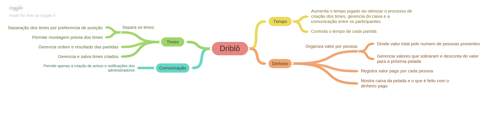

#### Histórico de Versão

| Data | Autor(es) | Descrição | Versão |
|:-----:|:-------:|:-------:|:-------:|
|22/08/2019| Marcelo Magalhães | Criação do documento |0.1|

## 1. Introdução

Um mapa mental é uma ferramenta utilizada para organizar, memorizar ou analisar um conteúdo em específico permitindo que você organize ideias de forma simples e lógica, representando-as visualmente.

## 2. Mapas Mentais

### Problemas

#### Versão 1.0

### Driblô

#### Versão 1.0

