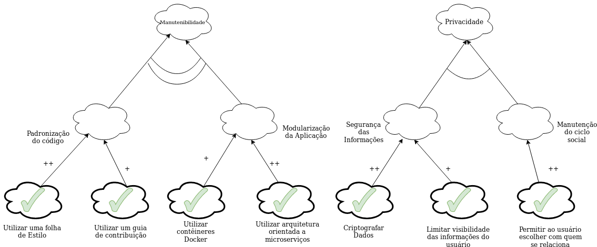

#### Histórico de versão

| Data       | Versão | Descrição                      | Autor(es)         |
| ---------- | ------ | ------------------------------ | ----------------- |
| 22/08/2019 | 0.1    | Criação do documento           | Samuel Borges     |
| 19/09/2019 | 0.2    | Adição dos tópico 1 e 3        | Samuel Borges     | 

## 1.Introdução

NFR são diagramas criados para resolver os problemas de representação dos requisitos não funcionais. Eles decompõem os requisitos, ajudando a entender e quantificar a prioridade de cada requisito em relação às necessidades descritas pelos stakholders.
Estão relacionados com o comportamento dum sistema e não com as suas funcionalidades –“descrevem comoo sistema faz e não o que faz”[CHUNG];

## 2.Diagramas

Diagramas NFR da aplicação.

**Versão 1.0**

**Autor: Samuel Borges**

## 3.Referências

- Modelagem NFR. Disponível em: http://jaejaneiro.orgfree.com/engsofnfr.pdf
