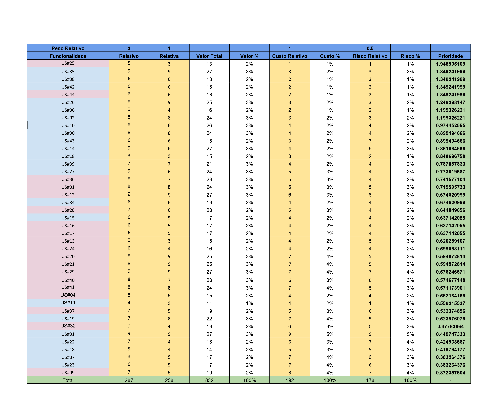

#### Histórico de versão

| Data       | Versão | Descrição                                         | Autor(es)                                           |
| ---------- | ------ | ------------------------------------------------- | --------------------------------------------------- |
| 20/09/2019 | 0.1    | Criação do documento, introdução, Priorização FTF | Matheus Rodrigues, Henrique Martins, Marcelo Araujo |

## 1. Introdução

Este documento tem com objetivo apresentar a análise feita com auxílio da técnica de priorização "First Things First" em cima da funcionalidades do Driblô, para assim se definir a ordem de desenvolvimento das funcionalidades.

### 2 Escopo

Será apresentada a análise das funcionalidades do Driblô, bem como os cálculos de benefício, penalidade, custo e risco relacionados às funcionalidades, indicados pela técnica de priorização utilizada (FTF).

### 3. First Things First

### 4. Resultados

Foram analisadas 40 funcionalidades. Cada uma delas recebeu uma atribuição de benefício (agregação de valor), penalidade (perda de valor com a falta da funcionalidade), custo (custo de desenvolvimento) e risco (viabilidade de implementação), e assim possibilitando o cálculo da prioridade de cada uma.
