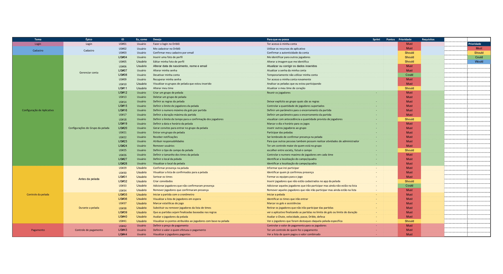

#### Histórico de versão

| Data       | Versão | Descrição                                            | Autor(es)                                           |
| ---------- | ------ | ---------------------------------------------------- | --------------------------------------------------- |
| 20/09/2019 | 0.1    | Criação do documento, introdução, Priorização MOSCOW | Matheus Rodrigues, Henrique Martins, Marcelo Araujo |

## 1.Introdução

Este documento tem por finalidade apresentar uma priorização das Histórias de usuário. Aplicando a técnica 'Moscow' para decidir quais são as prioridades.

## 2.Objetivo

Com essa técnica, pretende-se estabelecer um elo de prioridades e necessidade sobre os requisitos do Driblô, aquelas que tem maior valor para o usuário e também as que são básicas (realmente necessárias) relacionadas aos desenvolvedores.

## 3.Metodologia

O membros se reuniram e tomou toda a baseline de requisitos levantada até o momento. Então com base no backlog aplicamos a ténica 'Moscow' e criamos uma relação de prioridade sobre as histórias. Levamos em conta a visão do usuário mas também a visão do desenvolvedor e assim conseguimos, por consenso, estabelecer a prioridade definida a seguir.

## 4.Moscow

### Legenda

- **_Must_** = Maior prioridade, requisitos de essenciais para o projeto.
- **_Should_** = Prioridade secundária, requisitos importantes para o projeto.
- **_Could_** = Terceiro nível de prioridade, requisitos interessantes para o projeto.
- **_Would_** = Menor prioridade, requisitos desejáveis para o projeto.

## 5. Conclusão

Com a técnica de priorização do Moscow aplicada, pudemos classificar as histórias conforme as definições aqui relatadas. Assim, podemos ver quais funcionalidades possuem preferências e devem ter o foco primário sobre as demais.
