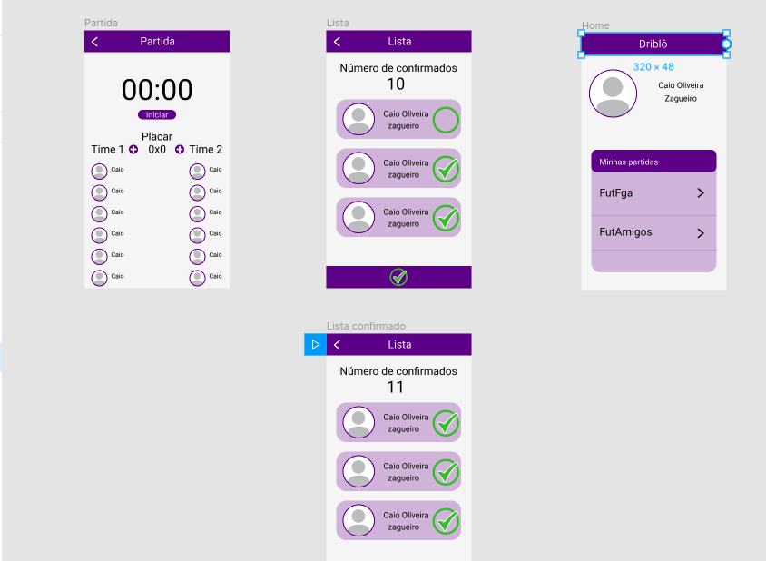

#### Histórico de versão

|    Data    |              Autor(es)              |                     Descrição                      | Versão |
| :--------: | :---------------------------------: | :------------------------------------------------: | :----: |
| 22/08/2019 |          Caio Oliveira          | Criação do documento e tópicos |  0.1   |
| 18/11/2019 |          Caio Oliveira          | Adição da versão 2.0 do protótipo |  0.2  |

## 1. Introdução

Protótipo é uma ferramenta usada  para se obter respostas iniciais sobre os requisitos através de um modelo funcional do produto esperado, antes de efetivamente construí-lo. Já que um protótipo é tangível, ele permite que as partes interessadas façam experiências com um modelo do seu produto final ao invés de somente discutirem representações abstratas dos seus requisitos.

## 2.Objetivo

O objetivo do protótipo é obter feedbacks do usuário e elicitar requisitos com bases nesses feedbacks.

## 3.Metodologia

O protótipo inicial foi feito na ferramenta figma para o design inicial das telas e fluxo da aplicação.

## 4. Protótipo

[Link versão 2.0 do protótipo](https://www.figma.com/file/sPjIQZdyQytusjRXPrEc6o/Dribl%C3%B4?node-id=0%3A1)

[Link versão 1.0 do protótipo](https://www.figma.com/file/mhQUPqOBKO8yN01qKs8uWA/Untitled)

## 5.Conclusão

Com a prototipação inicial foi possível validar as ideias e fluxos inicais da apliação.

## 6.Referências

- Google Design Sprint: como funciona e como aplicar no seu projeto. Disponível em : https://brasil.uxdesign.cc/google-design-sprint-como-funciona-e-como-aplicar-no-seu-projeto-279107363659?gi=bdd02dc3aab0
