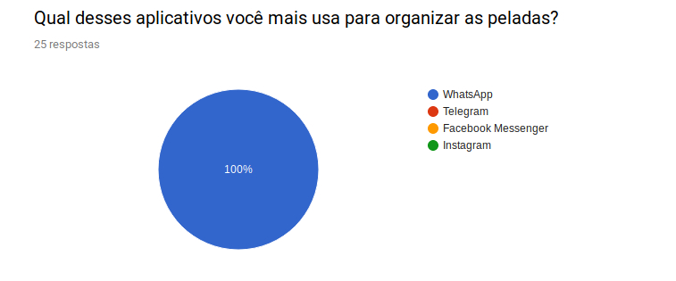
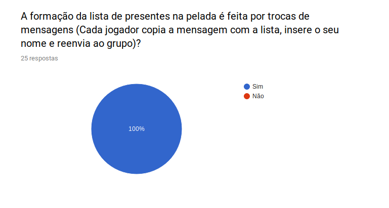
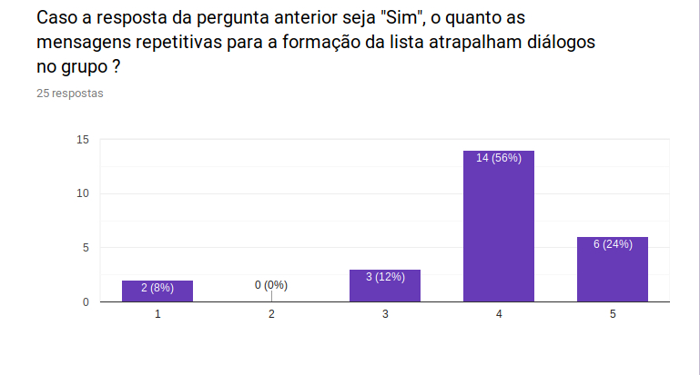
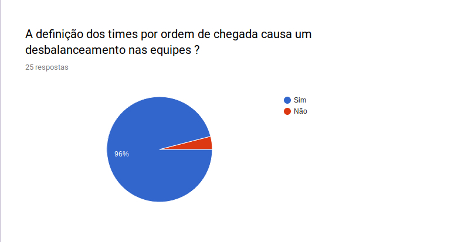
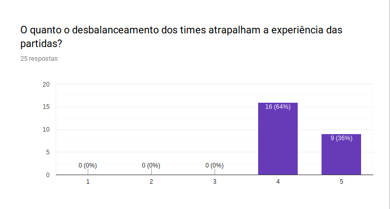
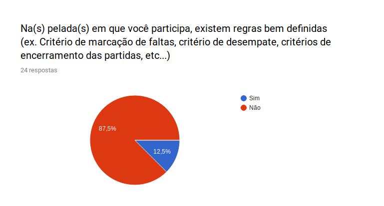
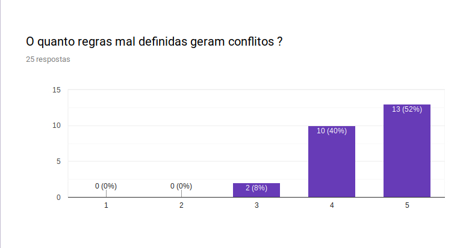
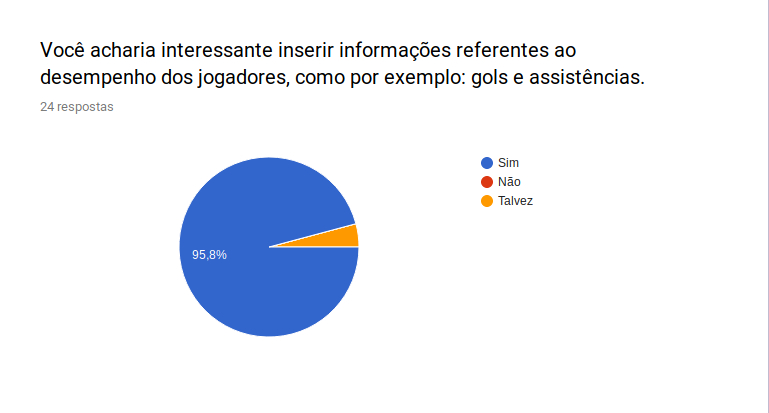
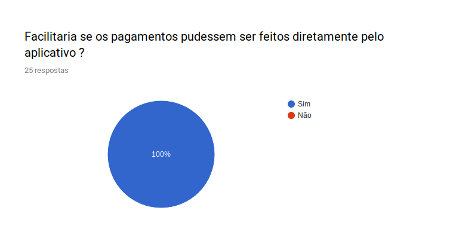
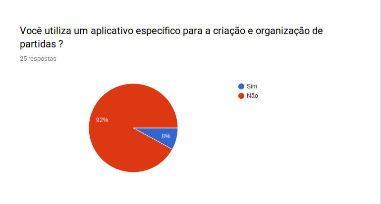

#### Histórico de versão

|    Data    |              Autor(es)              |                     Descrição                      | Versão |
| :--------: | :---------------------------------: | :------------------------------------------------: | :----: |
| 27/08/2019 | Rafael Teodosio |                Criação do documento                |  0.1   |
| 27/08/2019 | Rafael Teodosio |                Adição dos resultados                |  0.2   |

## 1. Introdução

O questionário é a maneira mais simples de conseguir opiniões de usuários, e possíveis usuários, desse modo entendendo o que os usuários esperam e gostariam.

## 2.Objetivo

Fornecer um parecer a respeito do público alvo da aplicação

## 3.Metodologia

O questionário foi elaborado por um integrante do grupo, e compartilhado entre jogadores de partidas amadoras, o que permitiu um melhor conhecimento do público.

## 4. Questionário

## 5.Conclusão

Após a análise dos resultados é notável os problemas gerados por conta da organização das partidas não ser realizada por um aplicativo específico.
