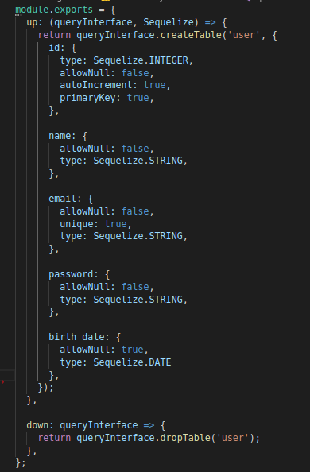

### Histórico de versão
| Data | Versão | Descrição | Autor(es) |
| ---- | ------ | --------- | --------- |
| 24/10/2019 | 0.1 | Criação e estruturação do documento| Byron Kamal e João Pedro Mota|

 

## 1. O que é

O Repository Pattern permite um encapsulamento da lógica de acesso a dados, proporcionando uma visão mais orientada a objetos das interações com a DAL (Data Access Layer).
Com o uso desse pattern, aplicamos em nossa camada de domínio o princípio da persistência ignorante (PI), ou seja, as entidades da camada de negócio não devem sofrer impactos pela forma com que a persistência no banco de dados é feita.

 

## 2. Benefícos
Os benefícos ao utilizar esse pattern são:
<ul>
<li> Permitir a troca do banco de dados utilizado sem afetar o sistema como um todo. </li>
<li> Código centralizado em um único ponto, evitando duplicidade. </li>
<li> Facilidade de implementação de testes unitários. </li>
<li> Diminuição do acoplamento entre classes. </li>
<li> Padronização de códigos e serviços. </li>
</ul>

 

## 3. Caso de Uso no Driblô

No caso do Driblô é realizado a implementação da lógica de acesso a dados. Para auxiliar na leitura e persistência dos dados, é necessário a utilização de um ORM (Object Relational Mapper) disponível no mercado. Nesse caso o utilizado foi o Sequelize.  
Com o Sequelize é possível escrever código JavaScript para que depois este seja transformado em SQL para manipulação dos dados.

 

## 4. Referências
- **Entendendo o Repository Pattern.** Disponivel em: <<https://medium.com/@renicius.pagotto/entendendo-o-repository-pattern-fcdd0c36b63b>>
- **Repository.** Disponpivel em: <<https://martinfowler.com/eaaCatalog/repository.html>>
