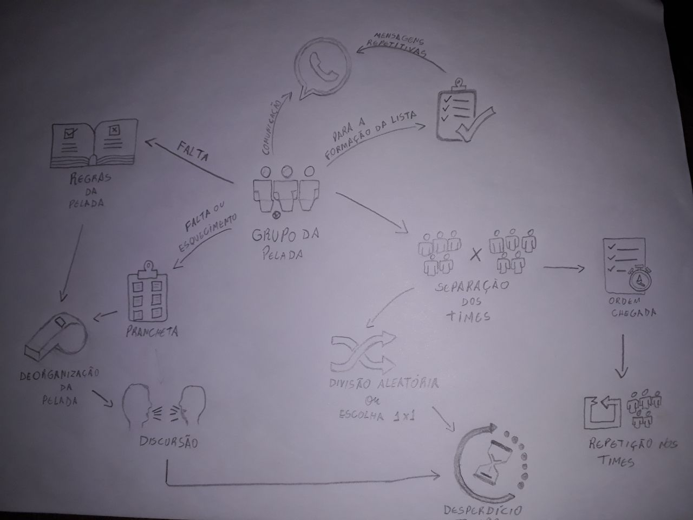
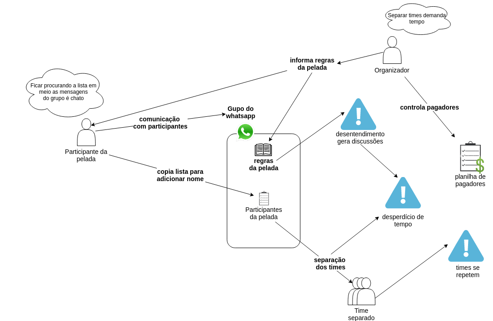
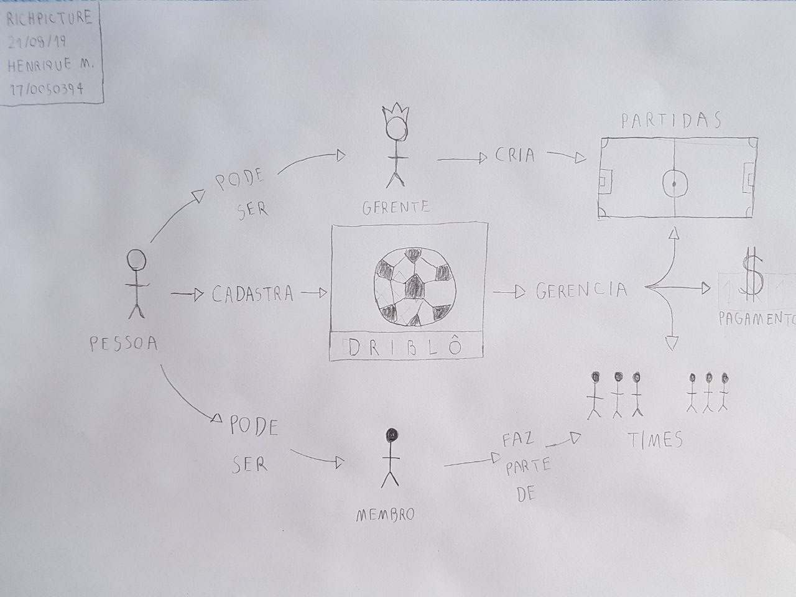
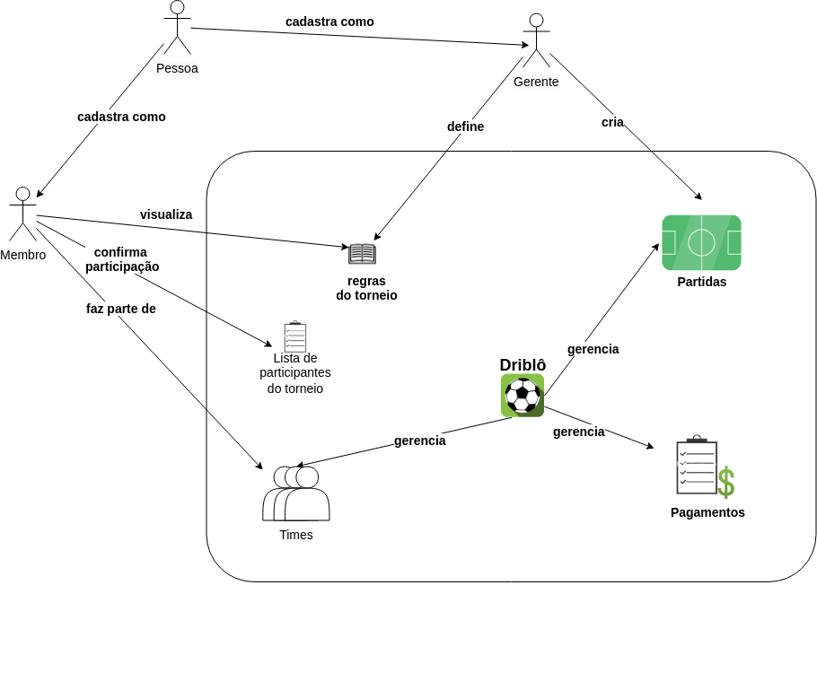

#### Histórico de Versão

| Data | Autor(es) | Descrição | Versão |
|:-----:|:-------:|:-------:|:-------:|
|19/08/2019|Byron Kamal, Caio Oliveira, João Pedro Mota, Matheus Rodrigues, Marcelo Araújo, Rafael Santos, Samuel Barros | Criação do documento |0.1|
|20/08/2019| Marcelo Araújo|Criação da introdução|0.2|
|21/08/2019| Henrique Martins |Adição da versão 1.0 do rich picture da aplicação|0.3|
|22/08/2019| Marcelo Araújo |Adição da versão 1.0 do rich picture da problemática|0.4|

## 1. Introdução

O Rich Picture é uma técnica que utiliza um desenho feito a mão ou digitalmente, contendo imagens, textos, símbolos, ícones, etc., para representar um sistema ou situação. Ele ajuda tanto desenvolvedores como pessoas leigas a entender um problema ou software, pois é fácil assimilar as imagens, por ele ser feito de forma intuitiva.

## 2. RichPictures

### Problemática

Rich Picture com foco nos problemas e dificuldades enfrentados pelos frequentadores de futebol amador.

#### Versão 1.0

#### Versão 1.1

### Aplicação

Rich Picture com foco na aplicação e escopo do projeto.

#### Versão 1.0

#### Versão 1.1

